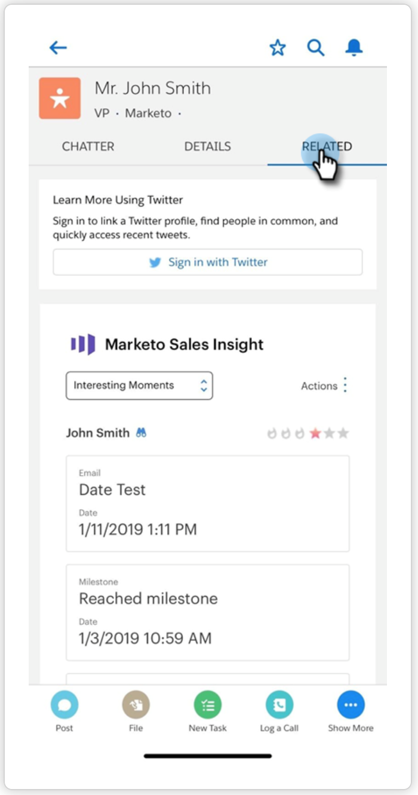

# Uso de momentos interesantes {#using-interesting-moments}

Los momentos interesantes son la clave para comunicarse con su equipo de ventas a través de la aplicación de perspectiva de ventas de Marketo.

>[!AVAILABILITY]
>
>Están disponibles para los clientes de Marketo Sales Insight y [Marketo Sales Connect](/help/marketo/product-docs/marketo-sales-connect/marketo/interesting-moments-in-msc.md) únicamente.

## ¿Qué es un momento interesante? {#what-is-an-interesting-moment}

¡Eso depende de ti! Usted decide qué información es relevante para su equipo de ventas. Es posible que el equipo de ventas desee saber cuándo un posible cliente:

* Visita la página de precios de su sitio web
* Hace clic en un vínculo de un nuevo correo electrónico de anuncio de producto
* Solicita una demostración de producto

## ¿Cómo creo un momento interesante?  {#how-do-i-create-an-interesting-moment}

1. Elija una [campaña inteligente](/help/marketo/product-docs/core-marketo-concepts/smart-campaigns/understanding-smart-campaigns.md), preferiblemente una que su equipo de ventas encontrará interesante si se activa.

   

1. Arrastre el paso de flujo **Momentos interesantes**.

   

1. Seleccione un **tipo** (Correo electrónico, Milestone o Web).

   

1. Escriba un mensaje al equipo de ventas en el campo **Description** que explique por qué esta acción importa.

   

   >[!NOTE]
   >
   >Marketo también agregará la fecha en la que se produjo y cómo se añadió el momento interesante (es decir, acción del posible cliente > paso del flujo, API SOAP).

## ¿Cómo puede esto ser aún más interesante?  {#how-can-this-get-even-more-interesting}

Tokens! Añádalos en el campo de descripción para proporcionar a su equipo de ventas información más específica, como la línea de asunto del correo electrónico que abrió el posible cliente o por quién lo envió. Compruebe qué tokens están disponibles para su uso en el glosario [Tokens para momentos interesantes](/help/marketo/product-docs/marketo-sales-insight/msi-for-salesforce/features/tabs-in-the-msi-panel/interesting-moments/trigger-tokens-for-interesting-moments.md).

>[!TIP]
>
>Empiece con cinco momentos interesantes, luego trabaje con su equipo de ventas para determinar qué información le interesa ver.

## ¿Cómo se ve un momento interesante en Marketo?  {#what-does-an-interesting-moment-look-like-in-marketo}

Los momentos interesantes se mostrarán en un [registro de actividades del posible cliente](/help/marketo/product-docs/core-marketo-concepts/smart-lists-and-static-lists/managing-people-in-smart-lists/using-the-person-detail-page.md).

## ¿Qué aspecto tiene un momento interesante en Salesforce?  {#what-does-an-interesting-moment-look-like-in-salesforce}

Una vez que haya [instalado la aplicación de perspectiva de ventas de Marketo](/help/marketo/product-docs/marketo-sales-insight/msi-for-salesforce/configuration/configure-marketo-sales-insight-in-salesforce-enterprise-unlimited.md), se mostrarán momentos interesantes en las páginas de posible cliente, contacto, cuenta o oportunidad. También aparecen en el panel Perspectiva de ventas de la Fuente de posibles clientes, Mejores apuestas y Lista de observación.

## ¿Qué aspecto tiene un momento interesante en Salesforce1? {#what-does-an-interesting-moment-look-like-in-salesforce-1}

Después de instalar o actualizar Marketo Sales Insight para Salesforce1, se mostrarán momentos interesantes bajo los vínculos relacionados del posible cliente.

