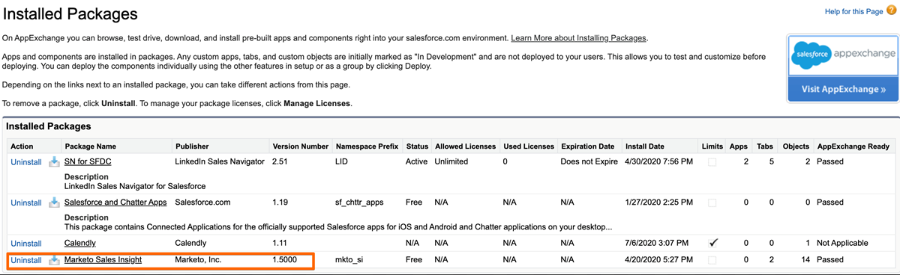

# Instalación del paquete de perspectivas de ventas de Marketo en la AppExchange de Salesforce {#install-marketo-sales-insight-package-in-salesforce-appexchange}

Debe instalar la aplicación Marketo Sales Insight en su suscripción a Salesforce para poder disfrutar de todas las ventajas que ofrece Sales Insight. Así es como.

>[!NOTE]
>
>**Se requieren permisos de administrador**

>[!NOTE]
>
>Marketo Sales Insight es compatible con el cifrado de Salesforce Platform (Shield).

1. Vaya a la [página de AppExchange para Marketo Sales Insight](https://appexchange.salesforce.com/listingDetail?listingId=a0N30000001SVZmEAO) y haga clic en **Consígalo ahora**.

   

1. Haga clic en **Iniciar sesión en la AppExchange** e inicie sesión con sus credenciales de Salesforce.

1. Introduzca su cuenta de Salesforce conectada y haga clic en **Instalar en producción**.

   

   >[!TIP]
   >
   >Si desea probarlo primero en el simulador de pruebas, elija **Instalar en Sandbox**.

1. Lea y acepte los términos y condiciones y haga clic en **Confirmar e instalar**.

   

1. Puede elegir &quot;Instalar solo para administradores&quot; (y proporcionar acceso MSI a perfiles específicos más adelante), &quot;Instalar para todos los usuarios&quot; o &quot;Instalar para perfiles específicos&quot;.

   

1. Puede ver el siguiente mensaje una vez que inicie el proceso de instalación. Recibirá un correo electrónico una vez que se haya completado la instalación. Haga clic en **Listo** para rechazar.

   

1. Compruebe que **Perspectiva de ventas de Marketo** está en los paquetes instalados.

   

1. Haga clic en **Configuración** junto a su nombre.

   

1. Busque &quot;objetos&quot; y, a continuación, haga clic en **Objetos** under **Crear**.

   

1. Compruebe que **Implementado** se comprueba para todos los artículos de Perspectiva de ventas de Marketo.

   

1. Si no se implementa un objeto, haga clic en **Editar** junto al elemento.

   

1. En **Estado de implementación** , seleccione **Implementado** y haga clic en **Guardar**.

   

¡bueno trabajo! Ahora ha instalado e implementado Marketo Sales Insight. Continúe y configúrelo para su equipo de ventas y observe cómo se disparan las ventas.

>[!MORELIKETHIS]
>
>* [Configurar Marketo Sales Insight en Salesforce Professional Edition](/help/marketo/product-docs/marketo-sales-insight/msi-for-salesforce/configuration/configure-marketo-sales-insight-in-salesforce-professional-edition.md)
>* [Configurar la perspectiva de ventas de Marketo en Salesforce Enterprise/Unlimited](/help/marketo/product-docs/marketo-sales-insight/msi-for-salesforce/configuration/configure-marketo-sales-insight-in-salesforce-enterprise-unlimited.md)
>* [Agregar el acceso a la perspectiva de ventas a los perfiles](/help/marketo/product-docs/marketo-sales-insight/msi-for-salesforce/configuration/add-sales-insight-access-to-profiles.md){target=&quot;_blank&quot;}

