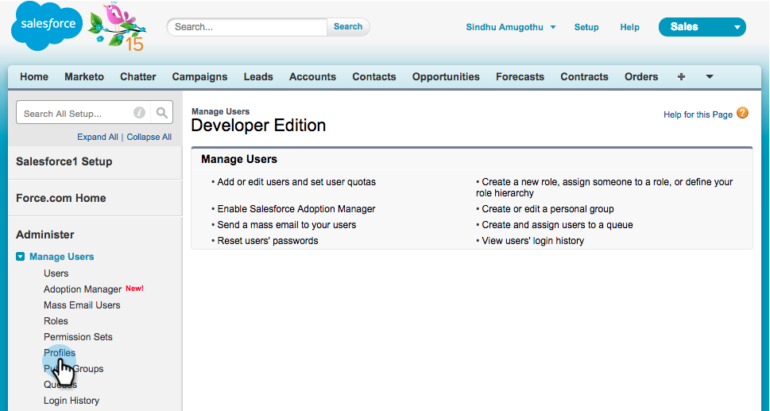

# Instalar y configurar MarketingTo Sales Insight en Salesforce1 {#install-and-configure-marketo-sales-insight-in-salesforce}

>[!NOTE]
>
>**Recordatorio**
>
>Clientes existentes, [Actualice su paquete MSI](https://docs.marketo.com/x/_gU6Ag) antes de continuar.

>[!PREREQUISITES]
>
>Si tiene Salesforce Enterprise/Unlimited:
>
>* [Paso 1 de 3: Añadir campos de marketing a Salesforce (Enterprise/Unlimited)](../../../../product-docs/crm-sync/salesforce-sync/setup/enterprise-unlimited-edition/step-1-of-3-add-marketo-fields-to-salesforce-enterprise-unlimited.md)
>* [Paso 2 de 3: Crear un usuario de Salesforce para el marketing (Enterprise/Unlimited)](../../../../product-docs/crm-sync/salesforce-sync/setup/enterprise-unlimited-edition/step-2-of-3-create-a-salesforce-user-for-marketo-enterprise-unlimited.md)
>* [Paso 3 de 3: Connect Marketing y Salesforce (Enterprise/Unlimited)](../../../../product-docs/crm-sync/salesforce-sync/setup/enterprise-unlimited-edition/step-3-of-3-connect-marketo-and-salesforce-enterprise-unlimited.md)
>* [Configurar la perspectiva de ventas de marketing en Salesforce Enterprise/Unlimited](../../../../product-docs/marketo-sales-insight/msi-for-salesforce/configuration/configure-marketo-sales-insight-in-salesforce-enterprise-unlimited.md)

>
>
Si tiene Salesforce Professional:
>
>* [Configuración de la perspectiva de ventas de marketing en Salesforce Professional Edition](../../../../product-docs/marketo-sales-insight/msi-for-salesforce/configuration/configure-marketo-sales-insight-in-salesforce-professional-edition.md)

>

>[!NOTE]
>
>La perspectiva de ventas de marketing en Salesforce1 incluye: Mejores apuestas, Alimentación de posibles clientes, Momentos interesantes y Añadir a la Campaña de marketing.

1. Habilitar la aplicación móvil de Salesforce1
1. Haga clic en **Configuración** y luego **Administración de móviles**.

   

1. Haga clic en **Salesforce1**.

   

1. Haga clic en **Configuración de Salesforce1**.

   

1. Haga clic en **Habilitar la aplicación del explorador móvil de Salesforce1**.

   

1. Haga clic en **Guardar**.

   

1. Seleccione **Administración móvil**.

   

1. Haga clic en **Administrar el menú de navegación móvil**.

   

1. Seleccione **Marcado **y **Añada **en los elementos de menú **Seleccionado **Seleccionado.

   

1. Seleccione **Marketo**, muévalo **Up **a un área deseada y haga clic en **Guardar**.

   

1. Ocultar objeto personalizado de marketing obsoleto
1. Haga clic en **Configuración**.

   

1. Seleccione **Administrar usuarios**.

   

1. Seleccione **Perfiles**.

   

1. Haga clic para **editar **cualquier perfil que desee.

   

1. En **Configuración de tabulación**, seleccione *first* **Marketo**.

   ** 

   **

1. Seleccione **Tabulación oculta**.

   ** 

   **

   >[!NOTE]
   >
   >¡Asegúrese de ocultar la ficha Marketo para todos los perfiles deseados!

1. Personalizar fichas
1. Haga clic en** +**.

   

1. Haga clic en **Personalizar mis fichas**.

   

1. Seleccione **Marketo** y **Añadir **it a las fichas seleccionadas.

   

1. Seleccione **Marketo**, muévalo **Up **a un área deseada y haga clic en **Guardar**.

   

1. Personalizar diseños de página
1. Haga clic en **Configuración**.

   

1. Haga clic en **Configuración**, escriba **Diseños de página** y haga clic en **Diseños de página** en Posibles clientes.

   >[!NOTE]
   >
   >Repita los pasos para cada diseño de página que utilice su organización (mercadotecnia, ventas, etc.) para objetos Contacto, Cuenta y Oportunidad.

   

1. Haga clic en **Editar** para realizar cambios en el diseño de posibles clientes.

   

1. Haga clic en **Visualforce Pages **y, a continuación, arrastre** Lead Mobile **a la sección Mobile Cards (Tarjetas móviles).

   

1. Cambie la altura a 66 y haga clic en **Aceptar**.

   

1. Haga clic en **Campos** y arrastre **Añadir a la Campaña de marketing **a la sección** Perspectiva de ventas de marketing **s.

   

   >[!TIP]
   >
   >Escriba &quot;Añadir a&quot; en la Búsqueda rápida para que Añadir a la Campaña de marketing sea fácil de encontrar.

1. Haga clic en **Guardar**.

   

¡Uf! Finalmente ha terminado de instalar Marketingto Sales Insight para Salesforce1! Adelante y déte una palmada en la espalda.

>[!MORELIKETHIS]
>
>* [Mejores apuestas en Salesforce1](best-bets-in-salesforce1.md)
>* [Momentos interesantes en Salesforce1](interesting-moments-in-salesforce1.md)
>* [Enviar mensaje de correo electrónico y Campaña de marketing y acciones de lista de observación en Salesforce1](send-marketo-email-and-campaign-and-watchlist-actions-in-salesforce1.md)

>

