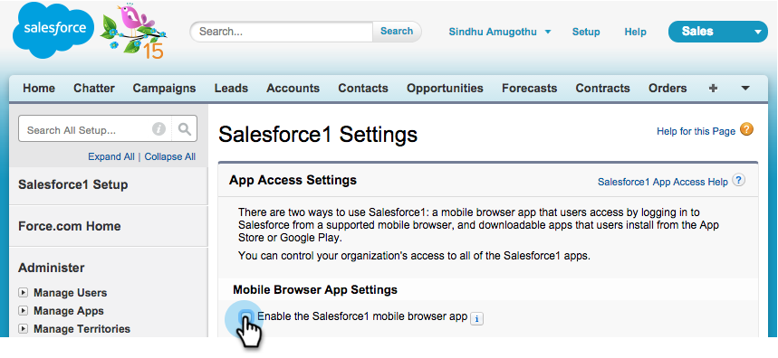
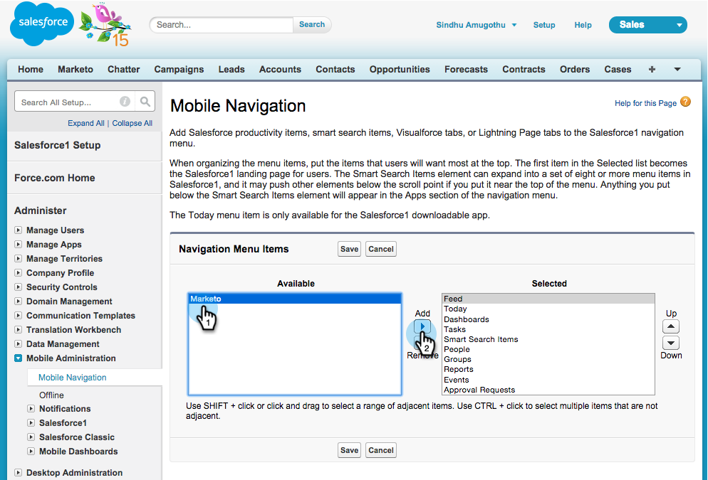

# Instalar y configurar Marketo Sales Insight en Salesforce1 {#install-and-configure-marketo-sales-insight-in-salesforce}

>[!NOTE]
>
>Clientes existentes, [Actualizar el paquete MSI](/help/marketo/product-docs/marketo-sales-insight/msi-for-salesforce/upgrading/upgrading-your-msi-package.md) antes de continuar!

>[!PREREQUISITES]
>
>Si tiene Salesforce Enterprise/Unlimited:
>
>* [Paso 1 de 3: Agregar campos de Marketo a Salesforce (Enterprise/Unlimited)](/help/marketo/product-docs/crm-sync/salesforce-sync/setup/enterprise-unlimited-edition/step-1-of-3-add-marketo-fields-to-salesforce-enterprise-unlimited.md)
>* [Paso 2 de 3: Crear un usuario de Salesforce para Marketo (Enterprise/Unlimited)](/help/marketo/product-docs/crm-sync/salesforce-sync/setup/enterprise-unlimited-edition/step-2-of-3-create-a-salesforce-user-for-marketo-enterprise-unlimited.md)
>* [Paso 3 de 3: Conectar Marketo y Salesforce (Enterprise/Unlimited)](/help/marketo/product-docs/crm-sync/salesforce-sync/setup/enterprise-unlimited-edition/step-3-of-3-connect-marketo-and-salesforce-enterprise-unlimited.md)
>* [Configurar la perspectiva de ventas de Marketo en Salesforce Enterprise/Unlimited](/help/marketo/product-docs/marketo-sales-insight/msi-for-salesforce/configuration/configure-marketo-sales-insight-in-salesforce-enterprise-unlimited.md)
>
>Si tiene Salesforce Professional:
>
>* [Configurar Marketo Sales Insight en Salesforce Professional Edition](/help/marketo/product-docs/marketo-sales-insight/msi-for-salesforce/configuration/configure-marketo-sales-insight-in-salesforce-professional-edition.md)
>

>[!NOTE]
>
>La perspectiva de ventas de Marketo en Salesforce1 incluye: Mejores apuestas, Fuente de posibles clientes, Momentos interesantes y Añadir a Marketo Campaign.

## Habilitar la aplicación móvil de Salesforce1 {#enable-the-salesforce1-mobile-app}

1. Haga clic en **Configuración** y luego **Administración de móviles**.

   

1. Haga clic en **Salesforce1**.

   

1. Haga clic en **Configuración de Salesforce1**.

   

1. Haga clic en **Habilitar la aplicación de navegador móvil Salesforce1**.

   

1. Haga clic en **Guardar**.

   

1. Select **Administración de móviles**.

   

1. Haga clic en **Administrar el menú de navegación móvil**.

   

1. Select **Marketo** y **Agregar** a la **Seleccionado** elementos de menú.

   

1. Select **Marketo**, muévalo **Up** a un área deseada y haga clic en **Guardar**.

   

## Ocultar objeto personalizado de Marketo obsoleto {#hide-outdated-marketo-custom-object}

1. Haga clic en **Configuración**.

   

1. Select **Administrar usuarios**.

   

1. Select **Perfiles**.

   

1. Haga clic en **editar** cualquier perfil deseado.

   

1. En **Configuración de pestañas**, seleccione _first_ **Marketo**.

   

1. Select **Tabulación oculta**.

   

   >[!NOTE]
   >
   >Asegúrese de ocultar la pestaña Marketo para todos los perfiles deseados.

## Personalizar fichas {#customize-tabs}

1. Haga clic **+**.

   

1. Haga clic en **Personalizar mis fichas**.

   

1. Select **Marketo** y **Agregar** hasta las fichas seleccionadas.

   

1. Select **Marketo**, muévalo **Up** a un área deseada y haga clic en **Guardar**.

   

## Personalizar diseños de página {#customize-page-layouts}

1. Haga clic en **Configuración**.

   

1. Haga clic en **Configuración**, tipo **Diseños de página** y haga clic en **Diseños de página** en Posibles clientes.

   >[!NOTE]
   >
   >Repita los pasos para cada diseño de página que utilice su organización (marketing, ventas, etc.) para objetos Contacto, Cuenta y Oportunidad.

   

1. Haga clic en **Editar** para realizar cambios en el diseño de posible cliente.

   

1. Haga clic en **Páginas de VisualForce** y, a continuación, arrastre **Móvil de posible cliente** a la sección Tarjetas móviles .

   

1. Cambie Height a 66 y haga clic en **OK**.

   

1. Haga clic en **Campos** y arrastre **Añadir a Marketo Campaign** a **Perspectiva de ventas de Marketo** para obtener más información.

   

   >[!TIP]
   >
   >Escriba &quot;Agregar a&quot; en la Búsqueda rápida para que Agregar a Marketo Campaign sea fácil de encontrar.

1. Haga clic en **Guardar**.

   

¡Uf! Por último, ha terminado de instalar Marketo Sales Insight para Salesforce1! Adelante, dale una palmada en la espalda.

>[!MORELIKETHIS]
>
>* [Mejores apuestas en Salesforce1](/help/marketo/product-docs/marketo-sales-insight/msi-for-salesforce/msi-for-mobile/best-bets-in-salesforce1.md)
>* [Momentos interesantes en Salesforce1](/help/marketo/product-docs/marketo-sales-insight/msi-for-salesforce/msi-for-mobile/interesting-moments-in-salesforce1.md)
>* [Enviar acciones de correo electrónico y de campaña y lista de observación de Marketo en Salesforce1](/help/marketo/product-docs/marketo-sales-insight/msi-for-salesforce/msi-for-mobile/send-marketo-email-and-campaign-and-watchlist-actions-in-salesforce1.md)

