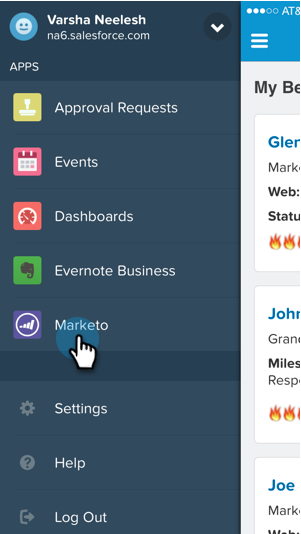

# Ver la fuente de posibles clientes en [!DNL Salesforce1] {#seeing-lead-feed-in-salesforce}

La Fuente de posibles clientes es una lista actualizada de eventos interesantes realizados por sus posibles clientes.

1. Vaya al área de **Marketo** en [!DNL Salesforce1].

   

1. Pulse la flecha hacia abajo.

   

1. Pulse **[!UICONTROL Fuente de posibles clientes]**.

   

   ¡Perfecto! Ahora ya sabe cómo llegar a su fuente de posibles clientes.

   

>[!MORELIKETHIS]
>
>* [Momentos interesantes en [!DNL Salesforce1]](/help/marketo/product-docs/marketo-sales-insight/msi-for-salesforce/msi-for-mobile/interesting-moments-in-salesforce1.md)
>* [Enviar correo electrónico de Marketo y acciones de campañas y listas de observación en [!DNL Salesforce1]](/help/marketo/product-docs/marketo-sales-insight/msi-for-salesforce/msi-for-mobile/send-marketo-email-and-campaign-and-watchlist-actions-in-salesforce1.md)
>* [[!DNL Best Bets] in [!DNL Salesforce1]](/help/marketo/product-docs/marketo-sales-insight/msi-for-salesforce/msi-for-mobile/best-bets-in-salesforce1.md)
