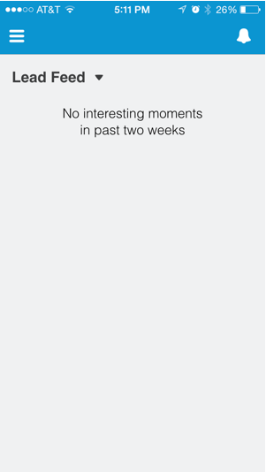

# Visualización de la fuente de posibles clientes en Salesforce1 {#seeing-lead-feed-in-salesforce}

La fuente de posibles clientes es una lista actualizada de eventos interesantes realizados por sus posibles clientes.

1. Vaya a la **Marketo** de Salesforce1.

   

1. Puntee en la flecha abajo.

   

1. Toque **Fuente de posibles clientes**.

   

   ¡Perfecto! ¡Ahora ya sabes cómo llegar a tu Fuente de Posibles Clientes!

   

>[!MORELIKETHIS]
>
>* [Momentos interesantes en Salesforce1](/help/marketo/product-docs/marketo-sales-insight/msi-for-salesforce/msi-for-mobile/interesting-moments-in-salesforce1.md)
>* [Enviar acciones de correo electrónico y de campaña y lista de observación de Marketo en Salesforce1](/help/marketo/product-docs/marketo-sales-insight/msi-for-salesforce/msi-for-mobile/send-marketo-email-and-campaign-and-watchlist-actions-in-salesforce1.md)
>* [Mejores apuestas en Salesforce1](/help/marketo/product-docs/marketo-sales-insight/msi-for-salesforce/msi-for-mobile/best-bets-in-salesforce1.md)

