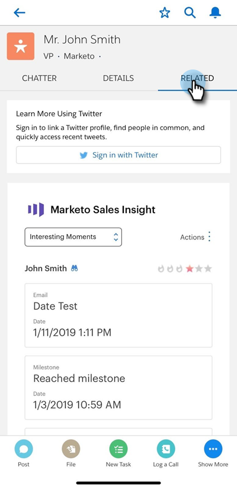

# Enviar un mensaje de correo electrónico y Campaña de marketing y acciones de lista de observación en Salesforce1 {#send-marketo-email-and-campaign-and-watchlist-actions-in-salesforce}

1. Vaya al área Detalle de posibles clientes en Salesforce1 y haga clic en la ficha **Relacionado**.

   

1. Haga clic en el dota (tres puntos pequeños). En la parte inferior puede elegir entre: &quot;Añadir a Campaña de marketing&quot;, &quot;Enviar correo electrónico de marketing&quot;, &quot;Vista en marketing&quot;, &quot;Añadir/eliminar de la lista de observación&quot;.

   

   >[!NOTE]
   >
   >¿Qué campañas inteligentes aparecen? Los déclencheur con &quot;Campaña es solicitada&quot;. Obtenga información sobre cómo configurar una [campaña desencadenada mediante &quot;Campaña solicitada](/help/marketo/product-docs/core-marketo-concepts/smart-campaigns/flow-actions/request-campaign.md)&quot;.

Genial, ahora los vendedores pueden participar activamente en el esfuerzo de mercadotecnia.

>[!NOTE]
>
>**Ejemplo**
>
>Las buenas campañas inteligentes para solicitar pueden sonar como:
>
>1. Alimentos a largo plazo - cuando no tienen presupuesto este año
>1. Ciclo de ventas activo: cuando el vendedor no desea ningún mensaje para el posible cliente excepto el suyo (utilice el indicador suspendido de marketing para cancelarlo temporalmente)

>
>
Sé creativo. ¿Qué desea automatizar el vendedor? ¡Sólo pregúntenlos y envíenlos por cable!
