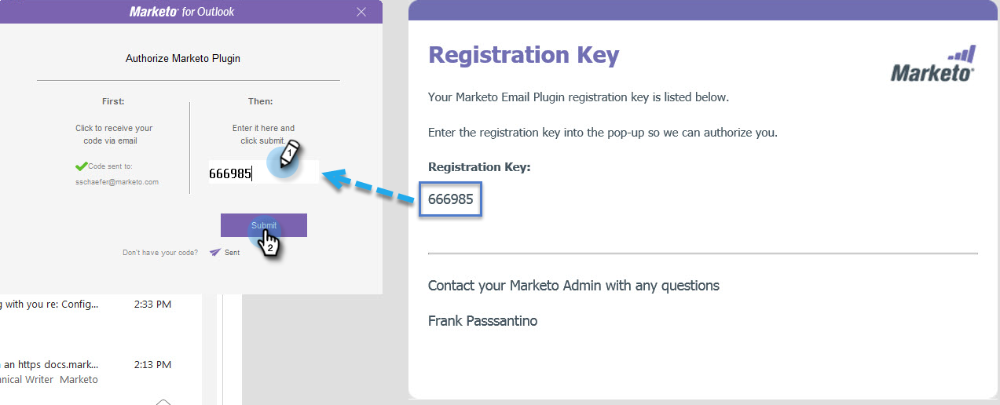

# Autorizar el complemento de MarketingTo Outlook {#authorize-the-marketo-outlook-plugin}

Para utilizar el complemento MSI de MarketingTo en Outlook, debe autorizarlo.

>[!PREREQUISITES]
>
>El complemento ya debe estar instalado y el administrador de marketing debe autorizarlo como usuario del complemento.

1. Haga clic en cualquiera de los botones Mensaje de marketing.

   

1. Cuando aparezca el cuadro de diálogo Autorizar complemento de marketing, haga clic en **Solicitar código**.

   

1. El código se envía a la dirección de correo electrónico predeterminada de la cuenta de Outlook.

   

1. Si la dirección de correo electrónico predeterminada de la cuenta de Outlook cierra la compra, recibirá una clave de registro. Ingrese en la ventana emergente y haga clic en **Enviar**.

   

   >[!NOTE]
   >
   >El código de registro **caduca pasados 14 días.**

1. Si la dirección de correo electrónico no está autorizada, recibirá este correo electrónico menos feliz. Póngase en contacto con el administrador de marketing para resolver el problema.

   
