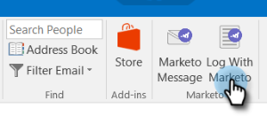
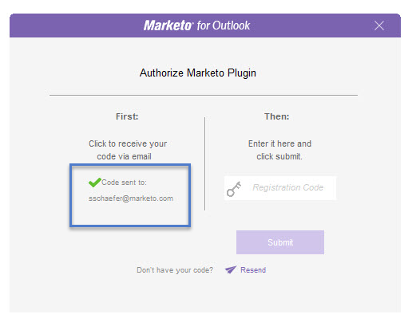

# Autorizar el complemento de Marketo [!DNL Outlook] {#authorize-the-marketo-outlook-plugin}

Para usar el complemento MSI de Marketo en [!DNL Outlook], debe autorizarlo.

>[!PREREQUISITES]
>
>El complemento ya debe estar instalado y el administrador de Marketo debe autorizarle como usuario del complemento.

>[!IMPORTANT]
>
>Microsoft ha lanzado [una nueva versión de Outlook para Windows](https://techcommunity.microsoft.com/t5/outlook-blog/new-outlook-for-windows-now-available/ba-p/3932068){target="_blank"}. Esta nueva versión no admite el complemento MSI Outlook existente. El complemento MSI Outlook seguirá funcionando para escritorios de Windows que ejecuten la versión clásica de Outlook. Para obtener más información acerca del nuevo Outlook para Windows para organizaciones, [haga clic aquí](https://techcommunity.microsoft.com/t5/outlook-blog/the-new-outlook-for-windows-for-organization-admins/ba-p/3929169){target="_blank"}.

1. Haga clic en cualquiera de los botones de mensaje de Marketo.

   

1. Cuando aparezca el cuadro de diálogo [!UICONTROL Autorizar complemento de Marketo], haga clic en **[!UICONTROL Código de solicitud]**.

   

1. El código se enviará a la dirección de correo electrónico predeterminada de la cuenta [!DNL Outlook].

   

1. Si se retira la dirección de correo electrónico predeterminada de la cuenta [!DNL Outlook], recibirá una clave de registro. Ingrésalo en la ventana emergente y haz clic en **[!UICONTROL Enviar]**.

   

   >[!NOTE]
   >
   >El código de registro **caduca pasados 14 días.**

1. Si la dirección de correo electrónico no está autorizada, recibirá este correo electrónico menos feliz. Póngase en contacto con su administrador de Marketo para resolver el problema.

   
