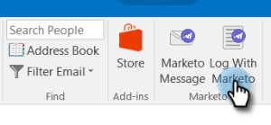

# Autorizar el complemento de Marketo Outlook {#authorize-the-marketo-outlook-plugin}

Para utilizar el complemento MSI de Marketo en Outlook, debe autorizarlo.

>[!PREREQUISITES]
>
>El complemento ya debe estar instalado y el administrador de Marketo debe autorizarle como usuario del complemento.

>[!IMPORTANT]
>
>Microsoft ha lanzado un [nueva versión de Outlook para Windows](https://techcommunity.microsoft.com/t5/outlook-blog/new-outlook-for-windows-now-available/ba-p/3932068){target="_blank"}. This new version does not support the existing MSI Outlook plugin. The MSI Outlook plugin will continue to work for Windows desktops running the classic version of Outlook. To learn more about the new Outlook for Windows for organizations, [click here](https://techcommunity.microsoft.com/t5/outlook-blog/the-new-outlook-for-windows-for-organization-admins/ba-p/3929169){target="_blank"}.

1. Haga clic en cualquiera de los botones de mensaje de Marketo.

   

1. Cuando aparezca el cuadro de diálogo Autorizar complemento de Marketo, haga clic en **Código de solicitud**.

   

1. El código se envía a la dirección de correo electrónico predeterminada de la cuenta de Outlook.

   

1. Si la dirección de correo electrónico predeterminada de la cuenta de Outlook desprotege, recibirá una clave de registro. Ingréselo en la ventana emergente y haga clic en **Enviar**.

   

   >[!NOTE]
   >
   >El código de registro **caduca pasados 14 días.**

1. Si la dirección de correo electrónico no está autorizada, recibirá este correo electrónico menos feliz. Póngase en contacto con su administrador de Marketo para resolver el problema.

   
