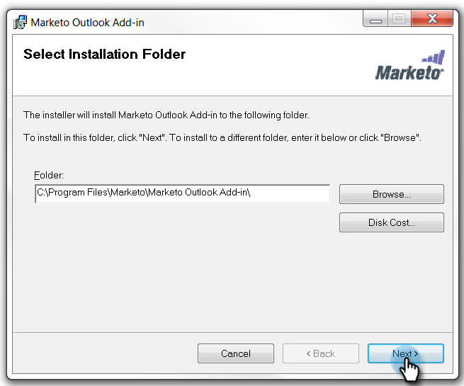

# Instalación del complemento de correo electrónico de Marketo para Outlook con un código de registro {#install-the-marketo-email-add-in-for-outlook-with-a-registration-code}

Si los usuarios pueden acceder a la configuración de administración de sus portátiles, puede enviarles un código de registro directamente.

Si no ha recibido ningún correo electrónico de invitación, pídale al administrador de Marketo que le invite.

>[!PREREQUISITES]
>
>Debe ser [se ha emitido una licencia de Marketo Email Add-in](/help/marketo/product-docs/marketo-sales-insight/msi-outlook-plugin/issue-a-marketo-email-add-in-license.md).

>[!IMPORTANT]
>
>La instalación no es compatible con los equipos en los que la carpeta Usuario de Windows contiene caracteres que no estén en inglés. Esta carpeta la genera automáticamente Windows en `<System Root>\Users\` en función del nombre de usuario de Windows y puede contener caracteres que no sean de inglés si el nombre de usuario de Windows no es de inglés. Trabaje con su equipo de TI para comprobar si tiene problemas de instalación.

>[!NOTE]
>
>El 20/1/10, la última versión del complemento de Outlook dejó de admitir el modo sin conexión.

## Descargar instalador {#download-installer}

1. Identifique su [Versión de Microsoft Outlook](https://support.office.com/en-us/article/what-version-of-outlook-do-i-have-b3a9568c-edb5-42b9-9825-d48d82b2257c)

1. Haga clic en el vínculo para descargar el instalador adecuado para su versión de Microsoft Outlook.

   >[!NOTE]
   >
   >En este momento, los vínculos siguientes solo funcionan en Microsoft Edge o haciendo clic con el botón derecho en Chrome. Perdón por cualquier inconveniente.

   | Versión de Outlook | Outlook de 32 bits | Outlook de 64 bits |
   |---|---|---|
   | Outlook 2000 | No admitido | N/A |
   | Outlook 2003 | [Descargar](https://munchkin.marketo.net/MarketoAddInSetup32.msi) | N/D |
   | Outlook 2007 | [Descargar](https://munchkin.marketo.net/MarketoAddInSetup32.msi) | N/D |
   | Outlook 2010 | [Descargar](https://munchkin.marketo.net/MarketoAddInSetup32.msi) | [Descargar](https://munchkin.marketo.net/MarketoAddInSetup64.msi) |
   | Outlook 2013 | [Descargar](https://munchkin.marketo.net/MarketoAddInSetup32.msi) | [Descargar](https://munchkin.marketo.net/MarketoAddInSetup64.msi) |
   | Outlook 2016 | [Descargar](https://munchkin.marketo.net/MarketoAddInSetup32.msi) | [Descargar](https://munchkin.marketo.net/MarketoAddInSetup64.msi) |
   | Outlook 2019 | [Descargar](https://munchkin.marketo.net/MarketoAddInSetup32.msi) | [Descargar](https://munchkin.marketo.net/MarketoAddInSetup64.msi) |
   | Outlook para Mac | No admitido | No admitido |
   | Outlook Web App | No admitido | No admitido |
   | Office 365* | [Descargar](https://munchkin.marketo.net/MarketoAddInSetup32.msi) | [Descargar](https://munchkin.marketo.net/MarketoAddInSetup64.msi) |

   *Versión de Office 365: Sólo cliente de Windows (en Windows 10, Enterprise o Pro).

## Copiar el código de registro {#copy-your-registration-code}

1. Copie el código de registro del correo electrónico de invitación que recibió.

   

1. Cierre Microsoft Outlook.

   

## Instalar {#install}

1. Ejecute el instalador.

   

   >[!NOTE]
   >
   >Si recibe una advertencia de seguridad, ¡no se preocupe! Haga clic en **Ejecutar**.

1. Haga clic en **Siguiente**.

   

1. Completar **Nombre**, **Apellidos**, **Dirección de correo electrónico** y, a continuación, copie y pegue el **Código de registro** del correo electrónico al formulario y haga clic en **Siguiente**.

   

   >[!TIP]
   >
   >Si la instalación falla, consulte con su departamento de TI para asegurarse de que el tráfico HTTPS no esté bloqueado. El instalador requiere que se abra el tráfico HTTPS.

1. Haga clic en **Siguiente** para instalar en la ubicación predeterminada.

   

1. Haga clic en **Siguiente**.

   

   >[!NOTE]
   >
   >Si recibe un mensaje de seguridad sobre un editor desconocido, haga clic en **Sí**.

1. La instalación ya ha finalizado, haga clic en **Cerrar**.

   

1. A continuación, abra Microsoft Outlook y vea los botones de Marketo.

   

   ¡Excelente! Ahora los botones de Marketo están en un lugar mejor.

Obtenga más información sobre el uso de las acciones Mensaje de Marketo y Registro con Marketo .

>[!MORELIKETHIS]
>
>* [Envío y seguimiento de un correo electrónico con el complemento de correo electrónico de Marketo para Outlook](/help/marketo/product-docs/marketo-sales-insight/msi-outlook-plugin/send-and-track-an-email-with-the-email-add-in-for-outlook.md)
>* [Envío y seguimiento desde Outlook mediante una plantilla de Marketo](/help/marketo/product-docs/marketo-sales-insight/msi-outlook-plugin/send-and-track-from-outlook-using-a-marketo-template.md)

