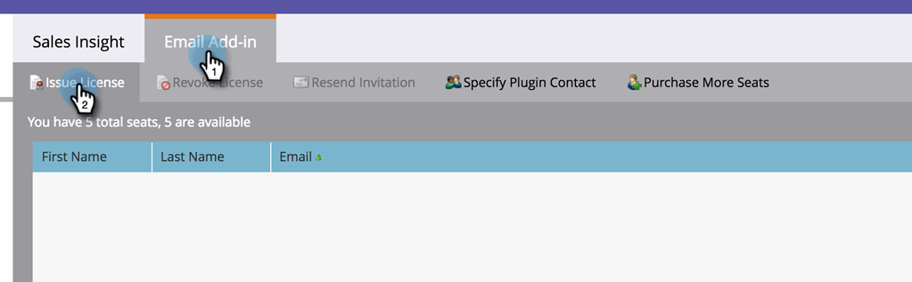

# Emitir una licencia de complemento de correo electrónico de Marketo {#issue-a-marketo-email-add-in-license}

Todo usuario que desee utilizar el complemento Marketo Email [!DNL Outlook] debe obtener primero una licencia. Existen dos formas de proporcionar la licencia.

* **[Instalación de clave de empresa](/help/marketo/product-docs/marketo-sales-insight/msi-outlook-plugin/install-the-marketo-add-in-for-outlook-with-an-enterprise-key.md)**: utilice este método cuando los representantes de ventas no tengan derechos de administrador en sus portátiles corporativos y no puedan instalar complementos, software, etc. en ellos. En este caso, el administrador de Marketo emite licencias para una lista de usuarios autorizados. A continuación, el equipo de TI implementa de forma remota el complemento en todos los equipos de los usuarios autorizados mediante la clave de empresa. A continuación, el usuario del complemento lo autoriza.
* **[Instalación del código de registro](/help/marketo/product-docs/marketo-sales-insight/msi-outlook-plugin/install-the-marketo-email-add-in-for-outlook-with-a-registration-code.md)**: utilice este método cuando los representantes de ventas tengan derechos de administrador sobre su portátil corporativo y puedan instalar complementos, software, etc. en él. Para este proceso, el administrador de Marketo emite licencias a una lista de usuarios autorizados y les envía correos electrónicos de registro directamente con vínculos de descarga. El representante de ventas recibe un correo electrónico con un vínculo de descarga de complemento y una dirección URL de registro única.

>[!AVAILABILITY]
>
>No todos los usuarios de Marketo Engage han adquirido esta funcionalidad. Póngase en contacto con el equipo de cuenta de Adobe (su administrador de cuentas) para obtener más información.

>[!NOTE]
>
>**Se requieren permisos de administrador**

1. En Mi Marketo, haz clic en **[!UICONTROL Administrador]** y luego en **[!UICONTROL Insight de ventas]**.

1. En la ficha **[!UICONTROL Complemento de correo electrónico]**, haga clic en **[!UICONTROL Licencia de problema]**.

   

1. Escriba las direcciones de correo electrónico de los representantes de ventas que necesitan autorización para usar el complemento y haga clic en **[!UICONTROL Emitir licencia]**. Para introducir varias direcciones de correo electrónico, sepárelas con una coma.

   

   >[!NOTE]
   >
   >* Para instalar el complemento de forma remota, deja la casilla de verificación _Enviar correo electrónico de registro con vínculo de descarga_ sin marcar y envía a tu equipo de TI tu [clave de empresa](/help/marketo/product-docs/marketo-sales-insight/msi-outlook-plugin/install-the-marketo-add-in-for-outlook-with-an-enterprise-key.md).
   >
   >* Si sus representantes de ventas tienen acceso de administrador a sus equipos, marque la casilla de verificación _Enviar correo electrónico de registro con vínculo de descarga_ y habrá terminado. Los destinatarios tienen **30 días** para hacer clic en el vínculo del correo electrónico antes de que caduque.

>[!MORELIKETHIS]
>
>* [Instalar el complemento de Marketo para [!DNL Outlook] con una clave de empresa](/help/marketo/product-docs/marketo-sales-insight/msi-outlook-plugin/install-the-marketo-add-in-for-outlook-with-an-enterprise-key.md)
>* [Instalar el complemento de correo electrónico de Marketo para [!DNL Outlook] con un código de registro](/help/marketo/product-docs/marketo-sales-insight/msi-outlook-plugin/install-the-marketo-email-add-in-for-outlook-with-a-registration-code.md)
>* [Actualizar el complemento de correo electrónico de Marketo para [!DNL Outlook]](/help/marketo/product-docs/marketo-sales-insight/msi-outlook-plugin/upgrade-your-marketo-email-add-in-for-outlook.md)
