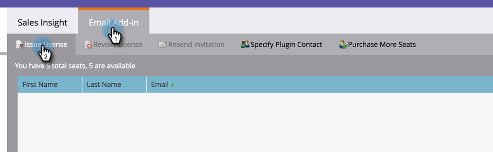

# Emitir una licencia de complemento de correo electrónico de Marketo {#issue-a-marketo-email-add-in-license}

Todo usuario que desee utilizar el complemento Outlook de correo electrónico de Marketo debe obtener primero una licencia. Existen dos formas de proporcionar la licencia.

* **[Instalación de clave empresarial](/help/marketo/product-docs/marketo-sales-insight/msi-outlook-plugin/install-the-marketo-add-in-for-outlook-with-an-enterprise-key.md)**: utilice este método cuando los representantes de ventas no tengan derechos de administrador sobre sus portátiles corporativos y no puedan instalar complementos, software, etc. en ella. En este caso, el administrador de Marketo emite licencias para una lista de usuarios autorizados. A continuación, el equipo de TI implementa de forma remota el complemento en todos los equipos de los usuarios autorizados mediante la clave de empresa. A continuación, el usuario del complemento lo autoriza.
* **[Instalación del código de registro](/help/marketo/product-docs/marketo-sales-insight/msi-outlook-plugin/install-the-marketo-email-add-in-for-outlook-with-a-registration-code.md)**: utilice este método cuando los representantes de ventas tengan derechos de administrador sobre su portátil corporativo y puedan instalar complementos, software, etc. en ella. Para este proceso, el administrador de Marketo emite licencias a una lista de usuarios autorizados y les envía correos electrónicos de registro directamente con vínculos de descarga. El representante de ventas recibe un correo electrónico con un vínculo de descarga de complemento y una dirección URL de registro única.

>[!AVAILABILITY]
>
>No todos los usuarios de Marketo Engage han adquirido esta funcionalidad. Póngase en contacto con el equipo de cuenta de Adobe (su administrador de cuentas) para obtener más información.

>[!NOTE]
>
>**Permisos de administración necesarios**

1. En Mi Marketo, haga clic en Administración y, a continuación, en Sales Insight.

1. En el **Complemento de correo electrónico** pestaña, haga clic en **Licencia de emisión**.

   

1. Introduzca las direcciones de correo electrónico de los representantes de ventas que necesitan autorización para utilizar el complemento y haga clic en **Licencia de emisión**.

   >

   >[!TIP]
   >
   >Puede introducir varias direcciones de correo electrónico, separadas por una coma.

   >[!NOTE]
   >
   >Para instalar el complemento de forma remota, deje la casilla de verificación sin marcar y envíe a su equipo de TI su [Clave de empresa](/help/marketo/product-docs/marketo-sales-insight/msi-outlook-plugin/install-the-marketo-add-in-for-outlook-with-an-enterprise-key.md).
   >
   >Si sus representantes de ventas tienen acceso de administrador a sus equipos, marque la casilla y ya está.

>[!MORELIKETHIS]
>
>* [Instalación del complemento de Marketo para Outlook con una clave de empresa](/help/marketo/product-docs/marketo-sales-insight/msi-outlook-plugin/install-the-marketo-add-in-for-outlook-with-an-enterprise-key.md)
>* [Instalación del complemento de correo electrónico de Marketo para Outlook con un código de registro](/help/marketo/product-docs/marketo-sales-insight/msi-outlook-plugin/install-the-marketo-email-add-in-for-outlook-with-a-registration-code.md)
>* [Actualizar el complemento de correo electrónico de Marketo para Outlook](/help/marketo/product-docs/marketo-sales-insight/msi-outlook-plugin/upgrade-your-marketo-email-add-in-for-outlook.md)
