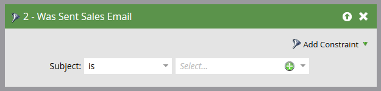

# Enviar y rastrear un correo electrónico con el Añada de correo electrónico para Outlook {#send-and-track-an-email-with-the-email-add-in-for-outlook}

Puede enviar y rastrear correos electrónicos con Marketing directamente desde Outlook.

>[!PREREQUISITES]
>
>Si aún no lo ha hecho, instale el complemento de correo electrónico [Marketing para Outlook](/help/marketo/product-docs/marketo-sales-insight/msi-outlook-plugin/install-the-marketo-email-add-in-for-outlook-with-a-registration-code.md).

1. Abra Microsoft Outlook y cree un nuevo correo electrónico.

   

   >[!CAUTION]
   >
   >Si incluye varios destinatarios en el correo electrónico, toda la actividad se rastreará en el primer destinatario.

1. Redacte su correo electrónico como lo haría normalmente y haga clic en **Enviar y realizar el seguimiento**.

   

   >[!NOTE]
   >
   >Si envía un mensaje de correo electrónico a alguien que no existe en la instancia de Marketing, se creará automáticamente un registro de persona para ellos. Su apellido siempre será &#39;mktUnknown&#39; para que pueda encontrarlos fácilmente.

   >[!TIP]
   >
   >Si desea utilizar una plantilla de Marketing, consulte [Enviar y realizar un seguimiento desde Outlook usando una plantilla](/help/marketo/product-docs/marketo-sales-insight/msi-outlook-plugin/send-and-track-from-outlook-using-a-marketo-template.md).

1. Eche un vistazo a la previsualización y haga clic en **Enviar**.

   

   >[!CAUTION]
   >
   >La tecnología antispam suele rechazar las aperturas y los clics que se producen en los 20 segundos posteriores al envío del correo electrónico, por lo que espere al menos ese tiempo para abrir/hacer clic mientras realiza la prueba.

   Para ver quién ha recibido los correos electrónicos enviados a través de Outlook, cree una lista inteligente con el filtro &quot;Se envió correo electrónico de ventas&quot;.

   

¡Es tan fácil! Aunque este correo electrónico fue enviado por Outlook de un vendedor, será rastreado en Marketing.

>[!MORELIKETHIS]
>
>[Registrar correo entrante de los posibles clientes en el mercado](/help/marketo/product-docs/marketo-sales-insight/using-msi/log-inbound-mail-from-your-leads-in-marketo.md)
