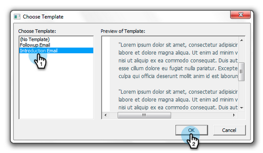

# Envío y seguimiento desde Outlook mediante una plantilla de Marketo {#send-and-track-from-outlook-using-a-marketo-template}

Si su equipo de marketing ha puesto plantillas a su disposición, así es como puede utilizarlas para ahorrar tiempo al componer sus correos electrónicos.

>[!NOTE]
>
>Las funciones de acciones de perspectiva de ventas, como Enviar correo electrónico de ventas, Agregar a la campaña de ventas y Tareas, no están disponibles en los complementos de correo electrónico de perspectiva de ventas para Gmail y Outlook. En este momento, los usuarios solo tienen la capacidad de enviar un correo electrónico rastreable con o sin una plantilla de correo electrónico de Marketo desde su cliente de correo electrónico al utilizar los complementos de correo electrónico de Sales Insight.

1. Abra Microsoft Outlook y haga clic en **Mensaje de Marketo**.

   

1. Seleccione la plantilla que desee, previsualícela y haga clic en **OK**.

   

1. Realice todas las ediciones necesarias y haga clic en **Envío y seguimiento**.

   

   >[!NOTE]
   >
   >No se admiten tokens con el complemento. Elimine los que puedan estar en la plantilla.

1. Compruebe la vista previa, asegúrese de que tenga buen aspecto y haga clic en **Enviar**.

   

   ¡Y ahí tienes! Usted fue capaz de ahorrar un montón de tiempo mediante el uso de plantillas que su equipo de marketing super impresionante hizo para usted.

>[!MORELIKETHIS]
>
>[Registrar correo entrante de sus posibles clientes en Marketo](/help/marketo/product-docs/marketo-sales-insight/using-msi/log-inbound-mail-from-your-leads-in-marketo.md)
