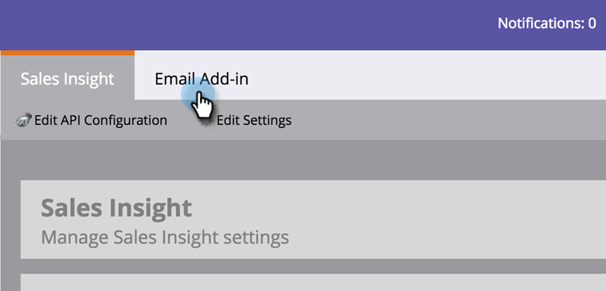

# Especificar administradores del complemento de perspectivas de ventas de Marketo {#specify-marketo-sales-insight-plugin-admins}

Puede especificar los contactos que desea que aparezcan en el aviso de correo electrónico que envía a los usuarios cuando los invita a configurar MSI en Outlook.

1. En Mi Marketo, haga clic en **Administrador** y luego **Perspectiva de ventas**.

   

1. Haga clic en el **Complemento de correo electrónico** pestaña .

   

1. Haga clic en **Especificar contacto del complemento**.

   

1. Haga clic en para especificar los contactos del complemento.

   

1. Haga clic en **Guardar**.

   

1. Los contactos seleccionados se incluirán en el correo electrónico que los representantes de ventas recibirán durante el proceso de autorización.

   

   ¡Perfecto!
