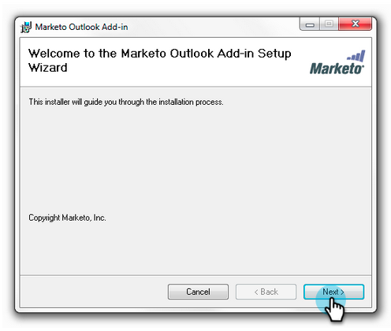

# Actualice el Añada de correo electrónico de marketing para Outlook {#upgrade-your-marketo-email-add-in-for-outlook}

Cuando haya disponible una nueva versión del Añada de correo electrónico de marketing para Outlook, siga estas instrucciones para actualizar.

## Descargar instalador {#download-installer}

Descargue el instalador adecuado para su versión de Microsoft Outlook.

<table> 
 <colgroup> 
  <col> 
  <col> 
  <col> 
  <col> 
  <col> 
 </colgroup> 
 <tbody> 
  <tr> 
   <th> </th> 
   <th colspan="2">Instalación de una sola invitación de usuario</th> 
   <th colspan="2">Instalación de clave empresarial</th> 
  </tr> 
  <tr> 
   <td><strong>Versión de Outlook</strong></td> 
   <td><strong>32 bits</strong></td> 
   <td><strong>64 bits</strong></td> 
   <td><strong>32 bits</strong></td> 
   <td><strong>64 bits</strong></td> 
  </tr> 
  <tr> 
   <td>Outlook 2000</td> 
   <td>No admitido</td> 
   <td>N/D</td> 
   <td>No admitido</td> 
   <td>N/D</td> 
  </tr> 
  <tr> 
   <td>Outlook 2003</td> 
   <td><a href="https://munchkin.marketo.net/MarketoAddInSetup32.msi" rel="nofollow">Descargar</a></td> 
   <td>N/D</td> 
   <td>No admitido</td> 
   <td>N/D</td> 
  </tr> 
  <tr> 
   <td>Outlook 2007</td> 
   <td><a href="https://munchkin.marketo.net/MarketoAddInSetup32.msi" rel="nofollow">Descargar</a></td> 
   <td>N/D</td> 
   <td>No admitido</td> 
   <td>N/D</td> 
  </tr> 
  <tr> 
   <td>Outlook 2010</td> 
   <td><a href="https://munchkin.marketo.net/MarketoAddInSetup32.msi" rel="nofollow">Descargar</a></td> 
   <td><a href="https://munchkin.marketo.net/MarketoAddInSetup64.msi" rel="nofollow">Descargar</a></td> 
   <td><a href="https://munchkin.marketo.net/MarketoAddInSetup32.msi" rel="nofollow">Descargar</a></td> 
   <td><a href="https://munchkin.marketo.net/MarketoAddInSetup64.msi" rel="nofollow">Descargar</a></td> 
  </tr> 
  <tr> 
   <td>Outlook 2013</td> 
   <td><a href="https://munchkin.marketo.net/MarketoAddInSetup32.msi" rel="nofollow">Descargar</a></td> 
   <td><a href="https://munchkin.marketo.net/MarketoAddInSetup64.msi" rel="nofollow">Descargar</a></td> 
   <td><a href="https://munchkin.marketo.net/MarketoAddInSetup32.msi" rel="nofollow">Descargar</a></td> 
   <td><a href="https://munchkin.marketo.net/MarketoAddInSetup64.msi" rel="nofollow">Descargar</a></td> 
  </tr> 
  <tr> 
   <td>Outlook 2016</td> 
   <td><a href="https://munchkin.marketo.net/MarketoAddInSetup32.msi" rel="nofollow">Descargar</a></td> 
   <td><a href="https://munchkin.marketo.net/MarketoAddInSetup64.msi" rel="nofollow">Descargar</a></td> 
   <td><a href="https://munchkin.marketo.net/MarketoAddInSetup32.msi" rel="nofollow">Descargar</a></td> 
   <td><a href="https://munchkin.marketo.net/MarketoAddInSetup64.msi" rel="nofollow">Descargar</a></td> 
  </tr> 
  <tr> 
   <td colspan="1">Outlook 2019</td> 
   <td colspan="1"><a href="https://munchkin.marketo.net/MarketoAddInSetup32.msi" rel="nofollow">Descargar</a></td> 
   <td colspan="1"><a href="https://munchkin.marketo.net/MarketoAddInSetup64.msi" rel="nofollow">Descargar</a></td> 
   <td colspan="1"><a href="https://munchkin.marketo.net/MarketoAddInSetup32.msi" rel="nofollow">Descargar</a></td> 
   <td colspan="1"><a href="https://munchkin.marketo.net/MarketoAddInSetup64.msi" rel="nofollow">Descargar</a></td> 
  </tr> 
  <tr> 
   <td colspan="1">Outlook O365 (solo Windows)</td> 
   <td colspan="1"><a href="https://munchkin.marketo.net/MarketoAddInSetup32.msi" rel="nofollow">Descargar</a></td> 
   <td colspan="1"><a href="https://munchkin.marketo.net/MarketoAddInSetup64.msi" rel="nofollow">Descargar</a></td> 
   <td colspan="1"><a href="https://munchkin.marketo.net/MarketoAddInSetup32.msi" rel="nofollow">Descargar</a></td> 
   <td colspan="1"><a href="https://munchkin.marketo.net/MarketoAddInSetup64.msi" rel="nofollow">Descargar</a></td> 
  </tr> 
  <tr> 
   <td>Outlook para Mac</td> 
   <td>No admitido</td> 
   <td>No admitido</td> 
   <td>No admitido</td> 
   <td>No admitido</td> 
  </tr> 
  <tr> 
   <td colspan="1">Outlook Web App</td> 
   <td colspan="1">No admitido</td> 
   <td colspan="1">No admitido</td> 
   <td colspan="1">No admitido</td> 
   <td colspan="1">No admitido</td> 
  </tr> 
 </tbody> 
</table>

## Actualizar {#upgrade}

1. Ejecute el instalador.

   

   Haga clic en Siguiente.
   

   >[!NOTE]
   >
   >En algunos casos faltan datos. Cópielo desde el correo electrónico de registro y cierre Outlook.

1. Cierre Microsoft Outlook.

   

1. Notará que toda la información está precargada. Haga clic en **Siguiente**.

   

   >[!TIP]
   >
   >Si la instalación falla, trabaje con el departamento de TI para asegurarse de que el tráfico HTTPS no está bloqueado. El programa de instalación requiere que se abra el tráfico HTTPS.

   Haga clic en Siguiente para realizar la instalación en la ubicación predeterminada.

   

1. Haga clic en **Siguiente**.

   

1. La instalación ya se ha completado. Haga clic en **Cerrar**.

   

1. Ahora abra Microsoft Outlook para ver la versión más reciente de los botones de marketing.

   

>[!MORELIKETHIS]
>
>* [Envío y seguimiento de un correo electrónico con el Añada de correo electrónico de marketing para Outlook](send-and-track-an-email-with-the-email-add-in-for-outlook.md)
>* [Enviar y realizar un seguimiento desde Outlook con una plantilla de marketing](send-and-track-from-outlook-using-a-marketo-template.md)

>

