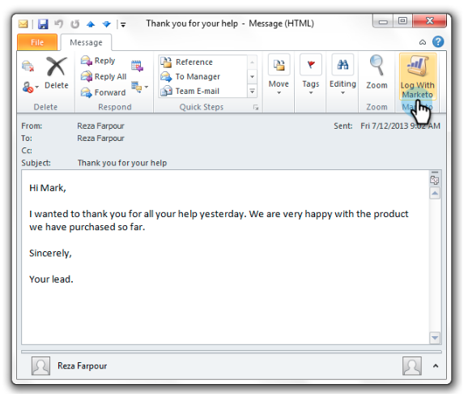

# Registrar correo entrante de sus posibles clientes en el mercado {#log-inbound-mail-from-your-leads-in-marketo}

Puede registrar las respuestas de los leads directamente en Outlook con el Añada de correo electrónico de Marketing to.

## Desde la aplicación principal de Outlook {#from-the-main-outlook-application}

1. Seleccione el correo electrónico que desee registrar y haga clic en Registro con el marcador.

>[!TIP]
>
>También puede hacer clic con el botón derecho en un mensaje y hacer clic en **Iniciar sesión con el marcador**.

Debería ver una confirmación.

## Desde el propio correo electrónico {#from-the-email-itself}

Si ha abierto el correo electrónico, puede hacer clic en el botón Registro con el marcador desde allí.

Debe ver la misma confirmación que el otro método.

Registre las respuestas de los posibles clientes para agregarlas a su historial en Marketing Cloud.

>[!MORELIKETHIS]
>
>* [Envío y seguimiento de un correo electrónico con el Añada de correo electrónico de marketing para Outlook](/help/marketo/product-docs/marketo-sales-insight/msi-outlook-plugin/send-and-track-an-email-with-the-email-add-in-for-outlook.md)
>* [Enviar y realizar un seguimiento desde Outlook con una plantilla de marketing](/help/marketo/product-docs/marketo-sales-insight/msi-outlook-plugin/send-and-track-from-outlook-using-a-marketo-template.md)

