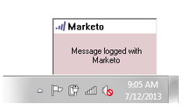

# Registrar correo entrante de sus posibles clientes en Marketo {#log-inbound-mail-from-your-leads-in-marketo}

Puede registrar las respuestas de sus posibles clientes en [!DNL Outlook] con el complemento de correo electrónico de Marketo.

## Desde la aplicación principal [!DNL Outlook] {#from-the-main-outlook-application}

1. Seleccione el correo electrónico que desea registrar y haga clic en **[!UICONTROL Registrar con Marketo]**.

>[!TIP]
>
>También puedes hacer clic con el botón derecho en un mensaje y hacer clic en **[!UICONTROL Iniciar sesión con Marketo]**.

Debería ver una confirmación.

## Desde el propio correo electrónico {#from-the-email-itself}

Si has abierto el correo electrónico, solo tienes que hacer clic en el botón **[!UICONTROL Iniciar sesión con Marketo]** desde allí.

Debería ver la misma confirmación que el otro método.

Registre las respuestas del posible cliente para agregarlas a su historial en Marketo.

>[!MORELIKETHIS]
>
>* [Enviar y rastrear un correo electrónico con el complemento de correo electrónico de Marketo para [!DNL Outlook]](/help/marketo/product-docs/marketo-sales-insight/msi-outlook-plugin/send-and-track-an-email-with-the-email-add-in-for-outlook.md)
>* [Enviar y rastrear desde [!DNL Outlook] usando una plantilla de Marketo](/help/marketo/product-docs/marketo-sales-insight/msi-outlook-plugin/send-and-track-from-outlook-using-a-marketo-template.md)
