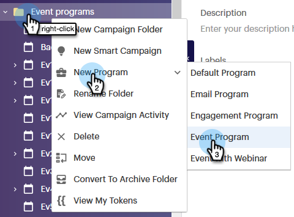

# Configuración de objetivos de evento {#setting-event-goals}

Asigne objetivos específicos a los eventos y vea cómo funcionan.

>[!IMPORTANT]
>
>No todos han comprado esta función. Póngase en contacto con el equipo de cuentas de Adobe (su administrador de cuentas) para obtener más información.

1. Cree un programa de eventos.

   

1. Asigne un evento a [!UICONTROL Nombre], seleccione [!UICONTROL Destino] carpeta y [!UICONTROL Canal].

   

1. Especifique el objetivo para [!UICONTROL Registrados] y [!UICONTROL Asistida]y haga clic en **[!UICONTROL Crear]** ([!UICONTROL Descripción] y [!UICONTROL Etiquetas] son opcionales).

   

¡Y eso es todo! Compruebe el estado del objetivo del evento haciendo clic en la variable [!UICONTROL Informes] pestaña .
