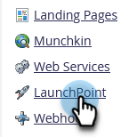
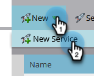
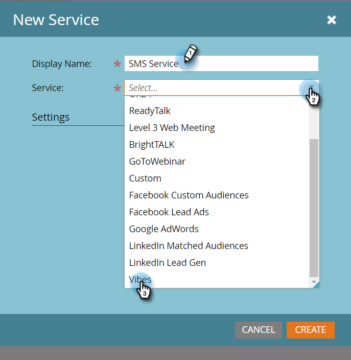
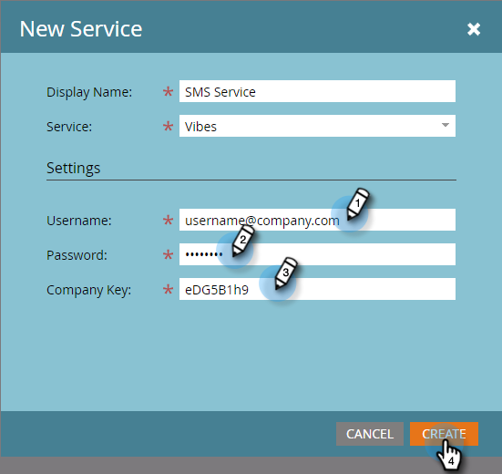
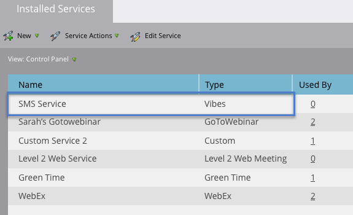

# Añadir Vibes como un servicio de LaunchPoint {#add-vibes-as-a-launchpoint-service}

Puede enviar mensajes SMS a las personas incluidas en sus campañas de SMS de Vibes, aprovechando la actividad de SMS para filtrar y almacenar en déclencheur las campañas de forma nativa en su instancia de Marketo Engage. En primer lugar, debe agregar Vibes como servicio de LaunchPoint.

>[!NOTE]
>
>**Se requieren permisos de administrador**

>[!PREREQUISITES]
>
>Debe tener una cuenta de Vibes activa y una licencia de Adobe para Vibes SMS.

1. En Mi Marketo, vaya al área **[!UICONTROL Administrador]**.

   

1. Haga clic en **[!UICONTROL LaunchPoint]**.

   

1. Haga clic en **[!UICONTROL Nuevo]** y luego en **[!UICONTROL Nuevo servicio]**.

   

1. Escriba un nombre para mostrar y, en la lista desplegable, seleccione **[!UICONTROL Vibes]**.

   

1. En Configuración, escribe tu Vibes [!UICONTROL Nombre de usuario], [!UICONTROL Contraseña] y [!UICONTROL Clave de compañía] (todos se encuentran en tu cuenta de Vibes). Haga clic en **[!UICONTROL Crear]**.

   

   El nuevo servicio SMS ahora aparece en la lista [!UICONTROL Servicios instalados].

   

>[!MORELIKETHIS]
>
>[Vídeos de demostración](https://vimeo.com/215233767/1ed136adbc)
