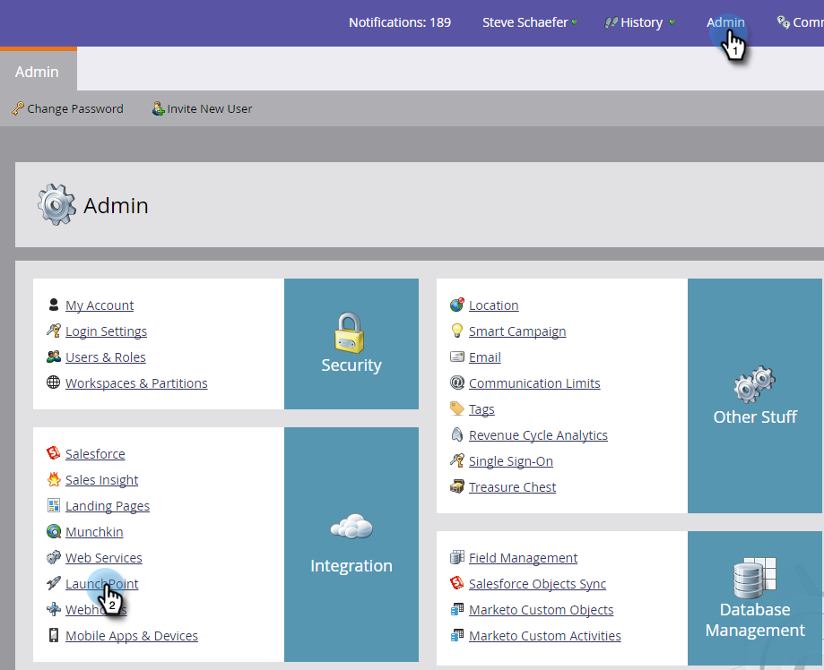

# Añadir vídeos como servicio de LaunchPoint {#add-vibes-as-a-launchpoint-service}

Puede enviar mensajes SMS a las personas de sus listas de vídeos y utilizar la actividad SMS para filtrar y almacenar en déclencheur las campañas. En primer lugar, debe añadir Vibes como servicio de LaunchPoint.

>[!NOTE]
>
>**Se requieren permisos de administrador**

>[!NOTE]
>
>Para completar esta configuración, necesita permisos de administrador de Marketo y una cuenta de Vídeos activa. Las credenciales solicitadas en el paso 4 a continuación son las credenciales de su cuenta de Vibes.

1. En Mi Marketo, haga clic en **Administrador** y luego **LaunchPoint**.

   

1. Haga clic en **Nuevo** y **Nuevo servicio**.

   

1. Introduzca un nombre para mostrar y, en la lista desplegable, seleccione **Vídeos**.

   

1. En Configuración, introduzca el nombre de usuario, la contraseña y la clave de empresa de API de Vibes. Haga clic en **Crear**.

   

   El nuevo servicio SMS ahora aparece en la lista Servicios instalados.

   
