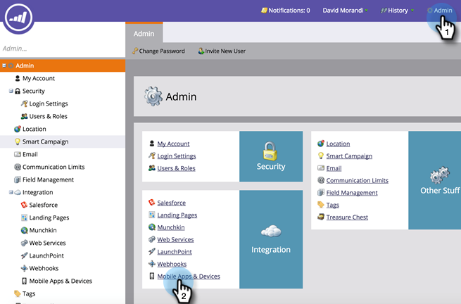
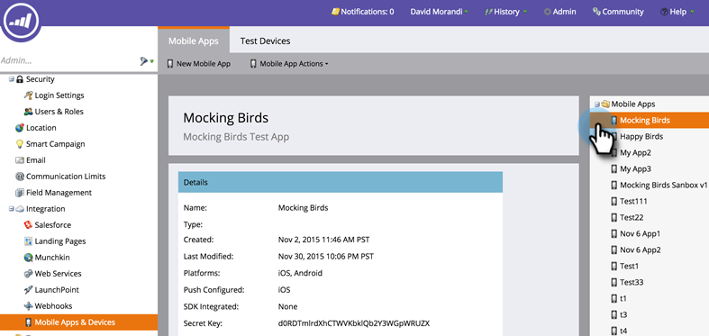
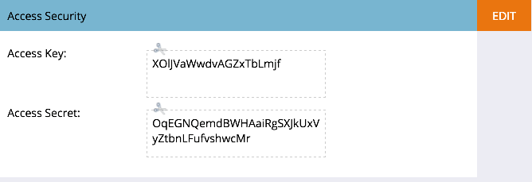

# Autenticar la seguridad de acceso móvil {#authenticate-mobile-access-security}

Para mejorar la seguridad de los usuarios de dispositivos móviles, Marketo proporciona dos nuevos identificadores: la [!UICONTROL clave de acceso] y el [!UICONTROL secreto de acceso]. Esto contribuye a garantizar que los usuarios que inician sesión en la aplicación sean quienes parecen ser.

Para habilitar los ID, debe adquirir los códigos y proporcionárselos a su departamento de TI para que puedan configurar una coincidencia segura.

>[!PREREQUISITES]
>
>Para habilitar esta función, póngase en contacto con el Soporte técnico y solicite &quot;Modo seguro Vespa&quot;.

1. En Marketo, seleccione **[!UICONTROL Administrador]** y haga clic en **[!UICONTROL Aplicaciones y dispositivos móviles]**.

   

1. Seleccione la aplicación móvil para la que desea habilitar el acceso seguro.

   

1. Desplácese hacia abajo y en la sección [!UICONTROL Seguridad de acceso], haga clic en **[!UICONTROL Editar]**.

   

1. Marque la casilla de verificación **[!UICONTROL Habilitar seguridad]**. Haga clic en **[!UICONTROL Guardar]**.

   

1. El área [!UICONTROL Seguridad de acceso] muestra ahora los dos códigos nuevos. Asegúrese de enviarlas a su departamento de TI.

   
