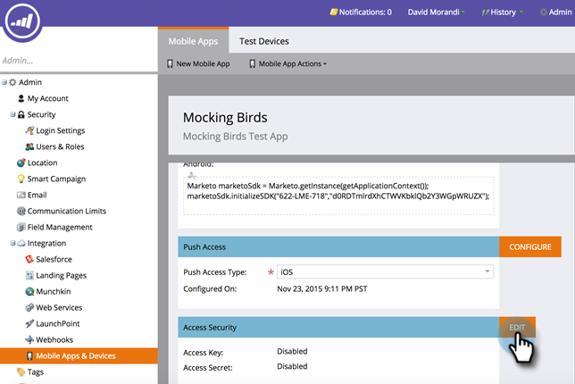

# Autenticar seguridad de acceso móvil {#authenticate-mobile-access-security}

Para mejorar la seguridad de los usuarios de Mobile, Marketing proporciona dos ID nuevos: la clave de acceso y el secreto de acceso. Esto ayuda a garantizar que los usuarios que inician sesión en la aplicación son quienes parecen ser.

Para habilitar los ID, debe adquirir los códigos y proporcionarlos a su departamento de TI para que puedan configurar una coincidencia segura.

>[!PREREQUISITES]
>
>Para habilitar esta función, póngase en contacto con el servicio de soporte técnico y solicite &quot;Modo seguro de Vespa&quot;.

1. En Marketing, seleccione **Administración** y haga clic en **Aplicaciones y dispositivos móviles**.

   

1. Seleccione la aplicación móvil para la que desea habilitar el acceso seguro.

   

1. Desplácese hacia abajo y en la sección Seguridad de acceso, haga clic en **Editar**.

   

1. Marque la casilla **Habilitar seguridad**. Haga clic en **Guardar**.

   

1. El área Seguridad de acceso ahora muestra los dos códigos nuevos. Asegúrese de enviarlos a su departamento de TI.

   
