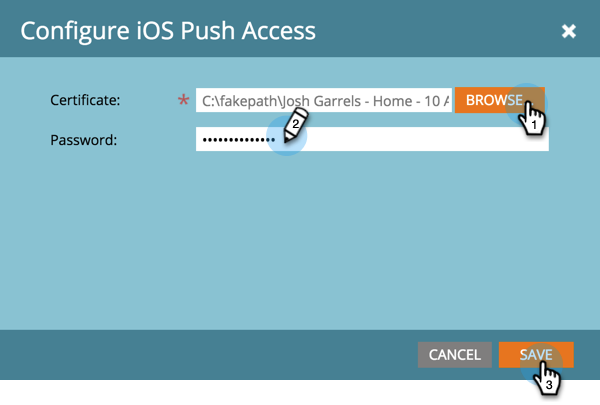

# Configurar el acceso push de la aplicación móvil iOS {#configure-mobile-app-ios-push-access}

1. Haga clic en **Administración**.

   

1. Seleccione **Aplicaciones móviles**.

   

1. Seleccione la aplicación móvil que desee.

   

1. En Tipo de acceso push, seleccione iOS y haga clic en **Configurar**.

   

   >[!NOTE]
   >
   >Necesitará un **certificado** y **contraseña** de su desarrollador de aplicaciones móviles. El desarrollador los recibe iniciando sesión en el Centro de miembros del desarrollador de Apple, configurando y descargando un certificado de notificación push para la aplicación y exportando el contenido. El desarrollador establece la contraseña al realizar la exportación. **IMPORTANTE**: El certificado debe ser apropiado para el tipo de entorno que está utilizando — Simulador para pruebas o Producción. Compruebe esto con el administrador de marketing o el desarrollador de aplicaciones móviles.

1. Seleccione el certificado, introduzca su contraseña y haga clic en **Guardar**.

   

¡bueno trabajo! Asegúrese de configurar también la aplicación con Android.

>[!MORELIKETHIS]
>
>[Configuración del acceso push de Android para aplicaciones móviles](/help/marketo/product-docs/mobile-marketing/admin/configure-mobile-app-android-push-access.md)
