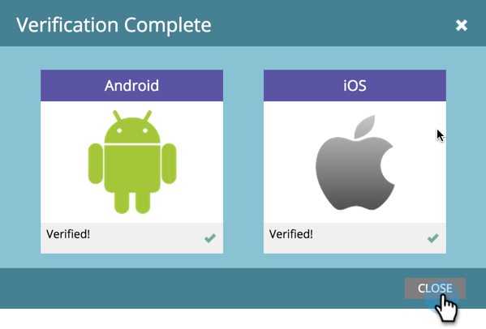

# Verificar la configuración de mensajes push {#verify-push-configuration}

>[!PREREQUISITES]
>
>El desarrollador de dispositivos móviles debe haber añadido el código SDK de Marketo a la aplicación móvil.

Verifique la configuración push para asegurarse de que todo esté sincronizado correctamente.

1. Haz clic en **[!UICONTROL Administrador]**.

   

1. Seleccione **[!UICONTROL Aplicaciones móviles]**.

   

1. Seleccione la aplicación móvil que desee.

   

1. Haga clic en **[!UICONTROL Acciones de aplicación móvil]** y seleccione **[!UICONTROL Verificar configuración push]**.

   

1. Confirme que las plataformas deseadas están comprobadas y haga clic en **[!UICONTROL Cerrar]**.

   

¡Todo listo! Ahora puede empezar a enviar notificaciones push.

>[!MORELIKETHIS]
>
>[Crear una notificación push](/help/marketo/product-docs/mobile-marketing/push-notifications/create-a-push-notification.md)
