# Añadir imágenes de mensaje en la aplicación {#add-in-app-message-images}

Aquí es donde puede elegir y personalizar las imágenes de los mensajes en la aplicación.

1. Seleccione el mensaje en la aplicación y haga clic en **[!UICONTROL Editar borrador]**.

   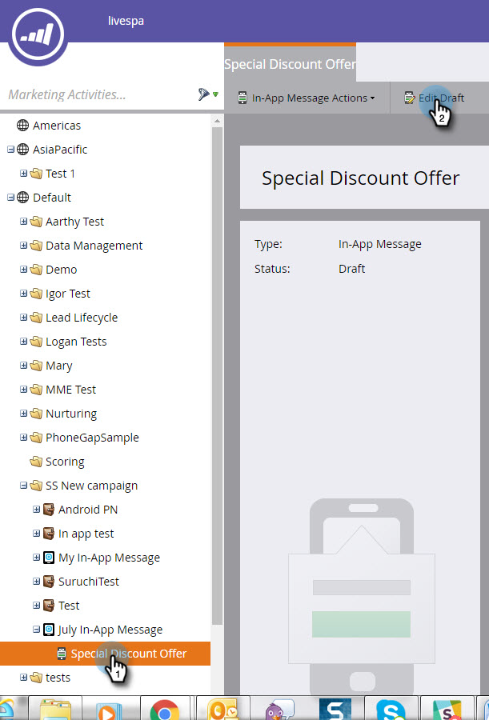

1. Elija una de las seis plantillas de la ficha Diseño. Hay tres opciones emergentes y tres opciones de pantalla completa.

   >[!TIP]
   >
   >¿Cuál es la diferencia entre las plantillas? Consulte [Elegir un diseño para el mensaje en la aplicación](/help/marketo/product-docs/mobile-marketing/in-app-messages/creating-in-app-messages/choose-a-layout-for-your-in-app-message.md) antes de comenzar.

   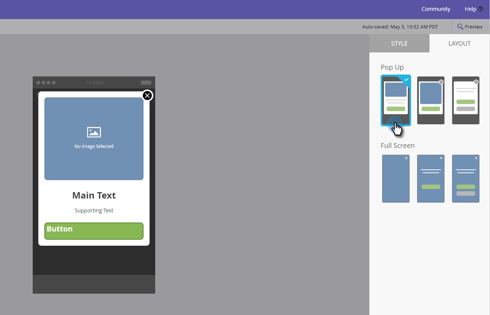

1. Haga clic en la ficha **[!UICONTROL Estilo]** y luego en el área de la imagen de la plantilla.

   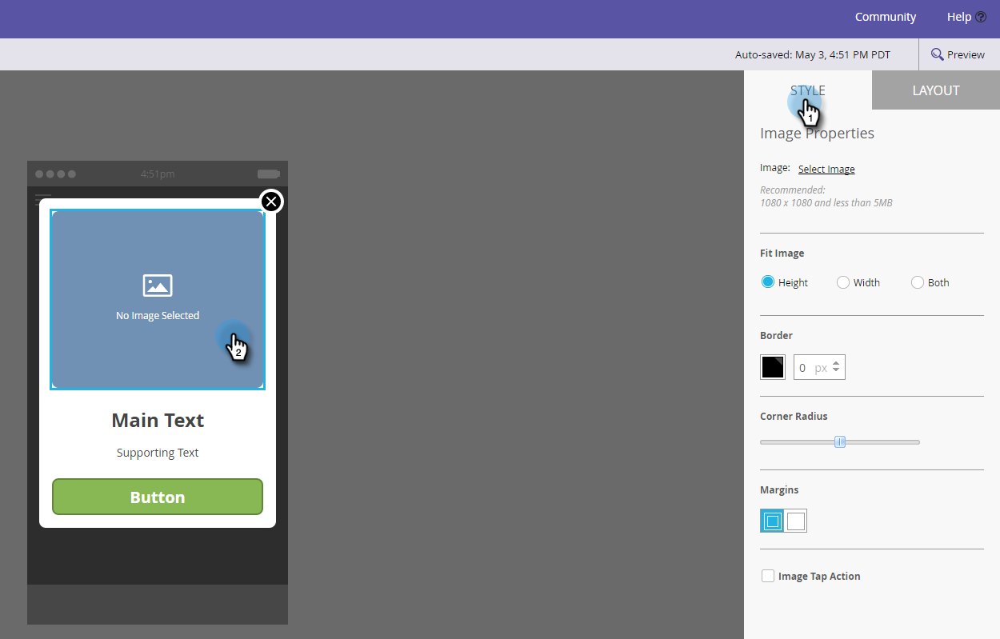

1. Haga clic en **[!UICONTROL Seleccionar imagen]**.

   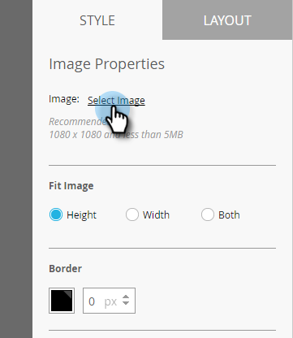

1. Seleccione la imagen de Design Studio y haga clic en **[!UICONTROL Seleccionar]**.

   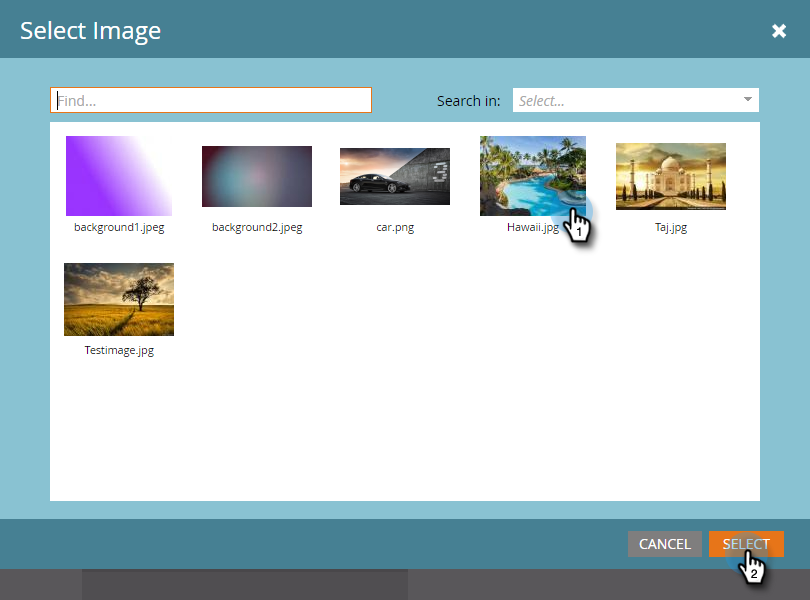

   >[!NOTE]
   >
   >El tamaño de la imagen está limitado a 1440 x 2560 px y 5 MB.

1. ¿Quieres cambiar de opinión y utilizar una imagen diferente? No hay problema. Haga clic en **X** junto al nombre de archivo de la imagen.

   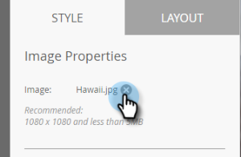

1. Haga clic en **[!UICONTROL Quitar]**. Ahora, puedes elegir otro.

   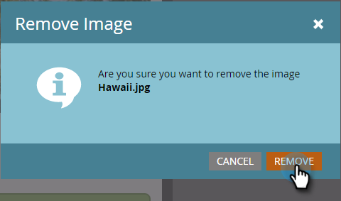

1. Con la imagen deseada en su lugar, en [!UICONTROL Propiedades de la imagen], seleccione un botón para ajustar la imagen por Altura, Anchura o Ambos.

   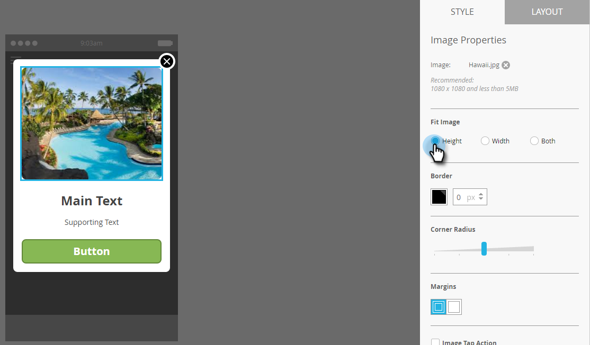

1. Opcionalmente, aplique un borde de imagen. El valor predeterminado es **Desactivado**. En primer lugar, seleccione el color haciendo clic en él o introduciendo los números hexadecimales o de RGB en el selector de color.

   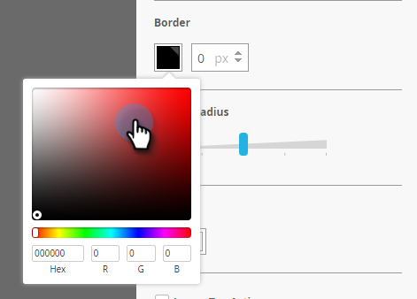

1. Haga clic en las flechas para cambiar el ancho del borde, en píxeles. Verá cómo cambia en la imagen.

   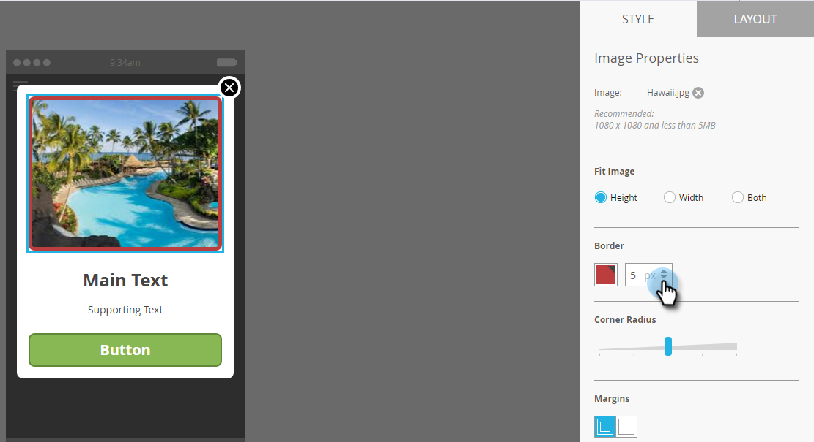

1. Seleccione un radio de esquina con el regulador. Seleccione una posición de izquierda a derecha: 0, 4, 8, 12 o 16 píxeles. La selección de 8 píxeles (centro) es la predeterminada.

   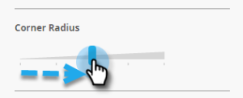

1. Seleccione un margen (activado o desactivado). **Activado** es la configuración predeterminada.

   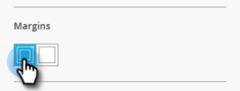

1. Marque la casilla para definir una acción de toque de imagen.

   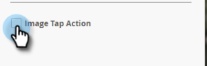

1. Hay una acción independiente para cada plataforma (consulte la Nota).

   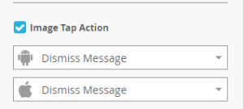

1. Haga clic en cada lista desplegable para mostrar las opciones. Seleccione uno.

   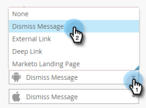

   >[!NOTE]
   >
   >Para las acciones de toque para imágenes, botones o fondos, puede configurar diferentes acciones para las plataformas Apple y Android. Por ejemplo, los vínculos profundos se gestionan de forma diferente en Apple y Android. Si el mensaje va únicamente a una plataforma u otra, deje la otra en la configuración predeterminada o seleccione **[!UICONTROL Ninguna]**.

¡Gran trabajo! Ahora es el momento de [crear el texto para el mensaje en la aplicación](/help/marketo/product-docs/mobile-marketing/in-app-messages/creating-in-app-messages/create-in-app-message-text.md).

>[!MORELIKETHIS]
>
>* [Explicación de los mensajes en la aplicación](/help/marketo/product-docs/mobile-marketing/in-app-messages/understanding-in-app-messages.md)
>* [Elija un diseño para su mensaje en la aplicación](/help/marketo/product-docs/mobile-marketing/in-app-messages/creating-in-app-messages/choose-a-layout-for-your-in-app-message.md)
