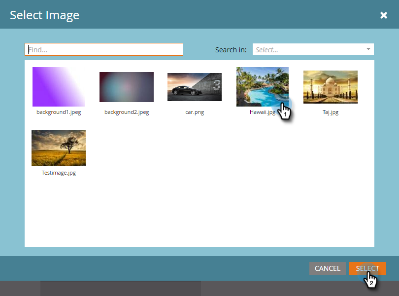

# Agregar imágenes de mensajes en la aplicación {#add-in-app-message-images}

Aquí es donde elige y personaliza sus imágenes de mensajes en la aplicación.

1. Seleccione el mensaje en la aplicación y haga clic en **Editar borrador**.

   

1. Elija una de las seis plantillas de la ficha Presentación. Hay tres opciones Emergente y tres opciones de Pantalla completa .

   >[!TIP]
   >
   >¿Cuál es la diferencia entre las plantillas? Consulte [Elija un diseño para el mensaje en la aplicación](/help/marketo/product-docs/mobile-marketing/in-app-messages/creating-in-app-messages/choose-a-layout-for-your-in-app-message.md) antes de comenzar.

   

1. Haga clic en el **Estilo** y haga clic en el área de imagen de la plantilla.

   

1. Haga clic en **Seleccionar imagen**.

   

1. Seleccione la imagen en Design Studio y haga clic en **Select**.

   

   >[!NOTE]
   >
   >El tamaño de la imagen está limitado a 1440 x 2560 píxeles y 5 MB.

1. ¿Cambiar de opinión y querer usar una imagen diferente? No hay problema. Haga clic en el **X** junto al nombre del archivo de imagen.

   

1. Haga clic en **Eliminar**. Ahora, puedes elegir otro.

   

1. Con la imagen en su sitio, en Propiedades de la imagen, seleccione un botón para ajustar la imagen por Alto, Ancho o Ambos.

   

1. Opcionalmente, aplique un borde de imagen. La configuración predeterminada es **Off**. En primer lugar, seleccione el color haciendo clic en él o introduciendo los números hexadecimales o RGB en el selector de color.

   

1. Haga clic en las flechas para cambiar el ancho del borde, en píxeles. Verá que cambia en la imagen.

   

1. Seleccione un radio de esquina con el control deslizante. Seleccione una posición de izquierda a derecha: 0, 4, 8, 12 o 16 píxeles. La selección predeterminada es de 8 píxeles (centro).

   

1. Seleccione un margen (activado o desactivado). **Activado** es la configuración predeterminada.

   

1. Marque la casilla para definir una acción de toque de imagen.

   

1. Hay una acción independiente para cada plataforma (consulte la Nota).

   

1. Haga clic en cada lista desplegable para mostrar las opciones. Seleccione una.

   

   >[!NOTE]
   >
   >Para pulsar acciones para imágenes, botones o fondos, puede configurar diferentes acciones para plataformas Apple y Android. Por ejemplo, los vínculos profundos se gestionan de forma diferente en Apple y Android. Si el mensaje va solo a una plataforma o a la otra, deje la otra en la configuración predeterminada o seleccione **Ninguna**.

¡bueno trabajo! Ahora, es hora de [cree el texto para el mensaje en la aplicación](/help/marketo/product-docs/mobile-marketing/in-app-messages/creating-in-app-messages/create-in-app-message-text.md).

>[!MORELIKETHIS]
>
>* [Explicación de los mensajes en la aplicación](/help/marketo/product-docs/mobile-marketing/in-app-messages/understanding-in-app-messages.md)
>* [Elija un diseño para el mensaje en la aplicación](/help/marketo/product-docs/mobile-marketing/in-app-messages/creating-in-app-messages/choose-a-layout-for-your-in-app-message.md)

