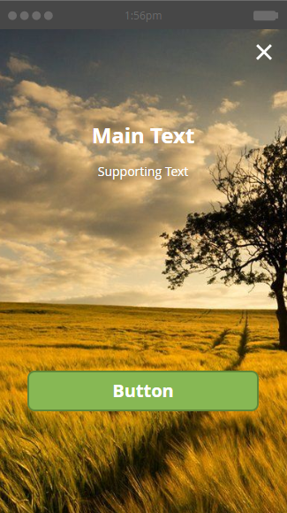
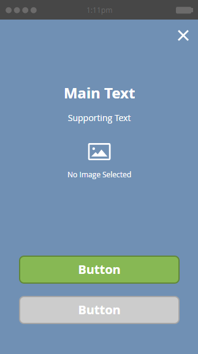

# Elija un diseño para el mensaje en la aplicación {#choose-a-layout-for-your-in-app-message}

Marketing proporciona seis diseños para crear mensajes en la aplicación.

* Las maquetaciones emergentes son más tradicionales y ideales si no tiene un equipo creativo que proporcione contenido y no necesita un aspecto específico. Puede crear y editar fácilmente su propio mensaje en la aplicación, en Marketing Cloud
* Los diseños de pantalla completa le permiten importar sus propios diseños terminados, lo que le proporciona una completa flexibilidad gráfica

## Diseños emergentes {#pop-up-layouts}

Los tres elementos emergentes distribuyen todos los elementos de diseño preestablecidos de oferta, incluyendo una imagen, texto, botones y un fondo.

El primer diseño emergente es la selección predeterminada por un buen motivo: Se adapta a la mayoría de los usos. Funciona bien con imágenes de menor resolución. Este diseño utiliza las fuentes estándar para su plataforma (Helvetica para Apple, Roboto para Android), por lo que siempre se ve bien en un teléfono o tablet. Puede cargar y colocar las imágenes principal y de fondo, escribir su propio texto principal y de apoyo, y configurar los botones principal y de despido. El texto está limitado a tres líneas de 24 píxeles. Los tamaños de tipo más grandes reducen el número de líneas.

La segunda presentación emergente elimina los cuadros de texto, lo que le da más espacio para una imagen más alta. Añada texto, en el estilo que elija, a la imagen antes de importarla, para obtener un aspecto personalizado.

El tercer diseño emergente es bueno si no necesita usar una imagen en el mensaje en la aplicación. Dos botones oferta mensajes destinatario una selección de acciones. El texto está limitado a tres líneas. Los tamaños de tipo más grandes reducirán el número de líneas disponibles.

## Diseños de pantalla completa {#full-screen-layouts}

Los tres diseños de estilo de pantalla completa están diseñados para que pueda importar ilustraciones gráficas completadas. Seleccione sus propias fuentes e inclúyalas en el gráfico para que coincidan con cualquier página web o promoción.

El primer diseño de pantalla completa oferta un lienzo en blanco. Muestra exactamente lo que se carga, sin estirar ni recortar la imagen (consulte el ejemplo siguiente). Se reduce para ajustarse, dejando áreas en blanco alrededor, dependiendo de la forma de la imagen. No se elimina ninguna parte de la imagen.

Observe que esta imagen horizontal muestra su ancho completo, dejando espacio en blanco encima y debajo.

El segundo diseño Pantalla completa agrega campos de texto y un botón.

A diferencia del primer diseño de pantalla completa, éste, junto con el tercer diseño de pantalla completa (abajo), expande la imagen colocada para ajustarse a la altura completa y recorta los lados. Según la imagen original, esto puede crear una imagen de fondo atractiva. Este ejemplo utiliza la misma imagen que la que se muestra arriba,

El tercer diseño de pantalla completa es el mismo que el segundo, excepto el segundo botón. Esto proporciona más opciones para destinatarios de mensajes.

Ahora que conoce las plantillas, es hora de elegir una cuando [cree sus imágenes de mensajes en la aplicación](add-in-app-message-images.md).

>[!MORELIKETHIS]
>
>* [Crear un mensaje en la aplicación](https://docs.marketo.com/display/docs/create+an+in-app+message)
>* [Explicación de los mensajes en la aplicación](../../../../product-docs/mobile-marketing/in-app-messages/understanding-in-app-messages.md)

>

