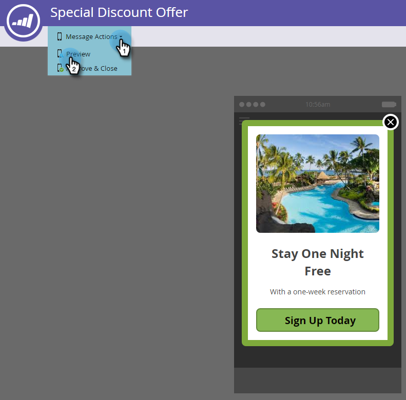

# Configure el botón Descartar y apruebe el mensaje {#set-up-the-dismiss-button-and-approve-the-message}

## Configurar las propiedades del botón de anulación {#configure-dismiss-button-properties}

El botón Rechazar tiene muchas opciones para permitirle configurarlo como desee.

1. En el editor, haga clic en el botón Rechazar.

   

1. Si desea cambiar el color del botón, haga clic en el cuadrado de selección de color. Seleccione un color haciendo clic en él o introduciendo los números hexadecimales o RGB en el selector de color. El negro es el valor predeterminado.

   

1. Seleccione un diseño de botón en la lista desplegable. Los botones de redondeo incluyen un color completo y una opción de degradado.

   

   >[!CAUTION]
   >
   >El color del botón puede mostrarse como una X blanca en un fondo blanco cuando se selecciona un diseño diferente en la lista desplegable. Si es así, simplemente seleccione negro u otro color en el cuadrado de selección de color para hacer visible la X blanca.

1. Puede hacer clic en el botón de la esquina izquierda para mover el botón de despido a la izquierda (el lado derecho es el predeterminado).

   

1. Haga clic en la lista desplegable de cada plataforma y seleccione una acción de toque para el botón Descartar.

   

   >[!NOTE]
   >
   >Debe darle al botón Rechazar una acción de toque, de modo que no haya ninguna casilla de verificación para habilitarlo. Descartar mensaje es la opción predeterminada (y obvia).

## Envolver {#wrap-it-up}

Todas las selecciones de gráficos, texto y botones se guardaron automáticamente. Ahora, estás listo para terminar el trabajo.

1. Para previsualización del mensaje en la aplicación, haga clic en la lista desplegable **Acciones de mensaje** y seleccione **Previsualización**.

   

1. Previsualización el mensaje en la aplicación por teléfono o tablet para asegurarse de que se muestra correctamente.

   

1. Si está satisfecho con el mensaje en la aplicación, haga clic en **Aprobar y cerrar**.

   

   >[!NOTE]
   >
   >También puede seleccionar **Aprobar y cerrar** directamente en la lista desplegable Acciones de mensajes (consulte el paso 1), pero ¿por qué no previsualización el mensaje primero, sólo para estar a salvo?

1. Para cerrar el editor sin aprobarlo, simplemente cierre la ficha. Se guarda automáticamente para que pueda volver y aprobarlo más tarde.

   

Tantas opciones, pero ahora tienes un bueno mensaje en la aplicación, ¡listo para continuar!

Ahora es el momento de [enviar su mensaje](https://docs.marketo.com/display/docs/send+your+in-app+message).

>[!MORELIKETHIS]
>
>* [Explicación de los mensajes en la aplicación](../../../../product-docs/mobile-marketing/in-app-messages/understanding-in-app-messages.md)
>* [Enviar su mensaje en la aplicación](https://docs.marketo.com/display/docs/send+your+in-app+message)
>* [Elija un diseño para el mensaje en la aplicación](choose-a-layout-for-your-in-app-message.md)

>

