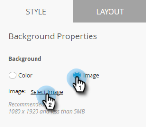

# Configuración del fondo de mensajes en la aplicación {#set-up-the-in-app-message-background}

La selección del fondo de un mensaje es un paso importante para finalizar el mensaje en la aplicación.

>[!TIP]
>
>Para las imágenes de fondo, las texturas y los degradados suelen funcionar mejor.

1. En el editor, haga clic en el área de fondo.

   

1. Para establecer un color, haga clic en **[!UICONTROL Color]** y, a continuación, seleccione el cuadrado de selección de color. Seleccione el color haciendo clic en él o introduciendo los códigos hexadecimales o RGB en el selector de color.

   

   >[!NOTE]
   >
   >El blanco sin formato, el valor predeterminado, suele ser un ganador.

1. Si desea usar un fondo, haga clic en **[!UICONTROL Imagen]** y luego en el vínculo **[!UICONTROL Seleccionar imagen]**.

   

1. Elija entre los archivos cargados en Design Studio. Haga clic en **[!UICONTROL Seleccionar]**.

   

   >[!NOTE]
   >
   >El tamaño de la imagen está limitado a 1440 x 2560 px y 5 MB.

1. Evalúe los resultados. ¡Uy, tal vez un color liso, una textura o un degradado funcionarán mejor!

   

1. Aplique un borde de imagen opcional. El valor predeterminado es **[!UICONTROL Desactivado]**. En primer lugar, seleccione el color haciendo clic en él o introduciendo los números hexadecimales o de RGB en el selector de color.

   

1. Haga clic en las flechas para variar el ancho del borde. Este borde verde de 12 píxeles de ancho cambia el aspecto del mensaje en la aplicación.

   

1. Seleccione un radio de esquina con el regulador. Seleccione una posición de izquierda a derecha: 0, 4, 8, 12 o 16 píxeles. La selección de 8 píxeles (centro) es la predeterminada.

   

1. Marque la casilla para establecer la acción de toque en segundo plano (desactivada de forma predeterminada).

   

   >[!NOTE]
   >
   >Para las acciones de toque para fondos, puede configurar diferentes acciones para plataformas de Apple y Android. Por ejemplo, los vínculos profundos se gestionan de forma diferente en Apple y Android. Si el mensaje va únicamente a una plataforma u otra, deje la otra en la configuración predeterminada o seleccione **[!UICONTROL Ninguna]**.

   Para finalizar el trabajo, el último paso es [configurar el botón Descartar](/help/marketo/product-docs/mobile-marketing/in-app-messages/creating-in-app-messages/set-up-the-dismiss-button-and-approve-the-message.md).

   >[!MORELIKETHIS]
   >
   >* [Explicación de los mensajes en la aplicación](/help/marketo/product-docs/mobile-marketing/in-app-messages/understanding-in-app-messages.md)
   >* [Enviar un mensaje en la aplicación](/help/marketo/product-docs/mobile-marketing/in-app-messages/sending-your-in-app-message/send-your-in-app-message.md)
   >* [Elija un diseño para su mensaje en la aplicación](/help/marketo/product-docs/mobile-marketing/in-app-messages/creating-in-app-messages/choose-a-layout-for-your-in-app-message.md)
