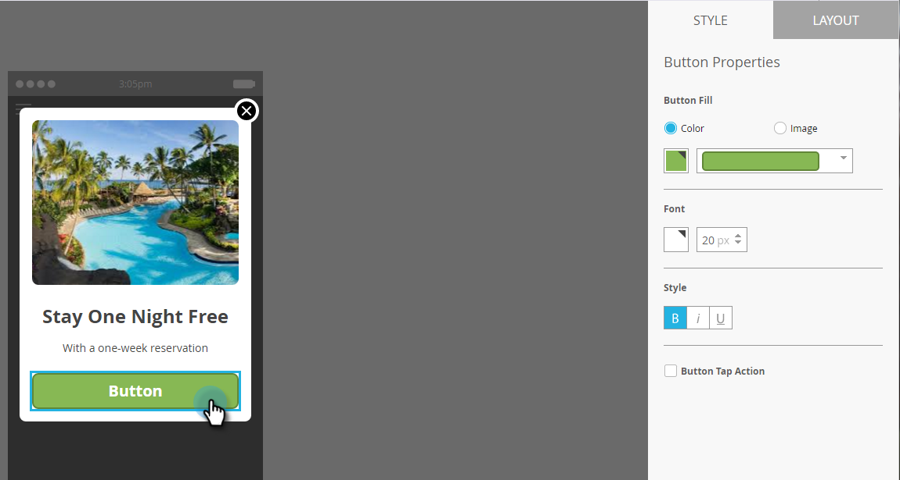
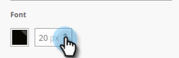

# Configuración del botón Mensaje en la aplicación {#set-up-the-in-app-message-button}

Puede utilizar el diseño de botón predeterminado, modificarlo o cargar su propia imagen de botón personalizada.

1. Haga clic en el botón para abrir la ficha Estilo y editarla.

   

1. Para cambiar el color del botón estándar, haga clic en el botón **Color**.

   

1. Haga clic en el cuadrado de selección de color y seleccione el color del botón haciendo clic en él o introduciendo los números hexadecimales o RGB en el selector de color.

   

1. Seleccione una forma en la lista desplegable. Las opciones de forma estándar incluyen esquinas nítidas, esquinas redondeadas y degradados.

   

1. Si desea utilizar su propia imagen para un botón, haga clic en el botón Imagen y haga clic en **Seleccionar imagen**.

   

1. Elija la imagen y haga clic en **Seleccionar**.

   

   >[!TIP]
   >
   >Al colocar una imagen personalizada para el botón, considere la posibilidad de borrar el texto del marcador de posición colocado sobre ella si la imagen ya incluye texto.

1. Haga clic en el cuadrado de selección de color y, a continuación, seleccione el color de fuente haciendo clic en él o introduciendo números hexadecimales o RGB en el selector de color.

   

1. Haga clic en las flechas para elegir el tamaño de fuente.

   

1. Elija el estilo de fuente para enfatizar: **Negrita**, _Cursiva_ o Subrayado.

   

1. Haga clic en el texto del botón para editarlo en línea.

   

1. Marque la casilla para establecer la acción de tocar el botón.

   

1. Haga clic en la lista desplegable de cada plataforma y seleccione una acción de toque.

   

   >[!NOTE]
   >
   >El botón siempre tiene una acción de toque, por lo que la casilla de verificación Tocar acción se selecciona automáticamente, con el mensaje predeterminado &quot;Descartar mensaje&quot;.

Casi ahí. El último paso es [configurar el fondo de los mensajes en la aplicación y el botón de despido](/help/marketo/product-docs/mobile-marketing/in-app-messages/creating-in-app-messages/set-up-the-in-app-message-background.md).

>[!MORELIKETHIS]
>
>* [Explicación de los mensajes en la aplicación](/help/marketo/product-docs/mobile-marketing/in-app-messages/understanding-in-app-messages.md)
>* [Elija un diseño para el mensaje en la aplicación](/help/marketo/product-docs/mobile-marketing/in-app-messages/creating-in-app-messages/choose-a-layout-for-your-in-app-message.md)

