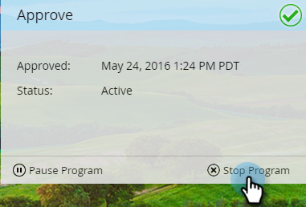

# Aprobar el mensaje en la aplicación {#approve-your-in-app-message}

Debe aprobar el envío antes de que se emita el mensaje en la aplicación.

1. Si todo parece correcto, haga clic en **[!UICONTROL Aprobar e iniciar]**.

   

   >[!NOTE]
   >
   >Si alguna parte del proceso de envío está incompleta, por ejemplo, si el mensaje en la aplicación no está aprobado, aparece un mensaje de advertencia que indica qué área necesita su atención. Soluciónelo y debería ver el mensaje en el paso 2.

1. Haga clic en **[!UICONTROL Aprobar e iniciar]**.

   

1. Si ha utilizado campos personalizados, Marketo puede tardar más en ejecutarse y, en su lugar, mostrará este mensaje.

   

1. El mensaje ahora es &quot;[!UICONTROL Activo]&quot;.

   

   >[!NOTE]
   >
   >Normalmente, un mensaje en la aplicación aprobado tarda entre 15 y 30 minutos en ser visible para los visitantes del programa. Recuerde que si utiliza campos personalizados, puede tardar varias horas o más.

   Puede pausar o detener un programa activo, pero existe una gran diferencia entre esas dos opciones.

1. Haga clic en **[!UICONTROL Pausar programa]** si necesita detener el programa durante un tiempo y reanudarlo más tarde. Cambiará al estado **[!UICONTROL En pausa]**.

   

   >[!NOTE]
   >
   >Las razones para la pausa podrían ser simplemente para detenerla durante un tiempo o si desea modificar el mensaje o ajustar la programación. Sin embargo, no puede cambiar a un mensaje diferente, solo editar el existente.

1. Si desea que el programa pausado siga ejecutándose, haga clic en **[!UICONTROL Reanudar programa]**.

   

1. Para detener el programa por completo, haga clic en **[!UICONTROL Detener programa]**.

   

1. Si está seguro de que desea detener el programa, haga clic en **[!UICONTROL Detener]**.

   

   >[!NOTE]
   >
   >Cuando detiene un programa, ya no se ejecuta y no se puede reanudar. Si desea volver a ejecutarlo, tendrá que volver a crearlo. ¡Así que asegúrate de haber terminado un programa antes de hacer clic en **[!UICONTROL Detener programa]**!

## Panel en la aplicación {#in-app-dashboard}

Una vez que se ejecute el programa, puede monitorizar su rendimiento con el panel de control en la aplicación, que aparece automáticamente después de aprobar el programa. Para volver al programa, haga clic en el vínculo en la esquina superior derecha y seleccione **[!UICONTROL Panel de control de Campaign]**.

¡Eso es todo, amigos!
