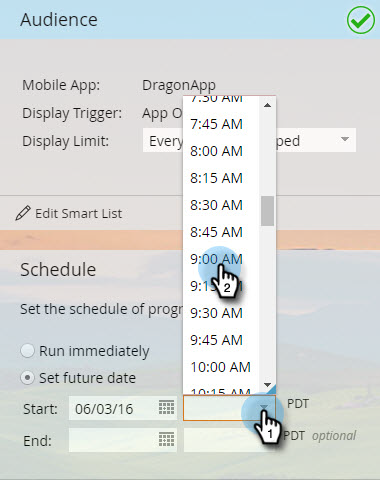
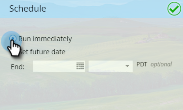

# Programar el mensaje en la aplicación {#schedule-your-in-app-message}

Envíe el mensaje ahora o programe para más tarde.

1. Para programar un mensaje en la aplicación, selecciona **[!UICONTROL Establecer fecha futura]** y elige una fecha de inicio en el calendario desplegable.

   

1. Seleccione una hora de inicio en la lista desplegable.

   

1. La fecha y la hora de finalización son opcionales; selecciónelas en los desplegables.

   

1. O bien, para ejecutar el programa en este momento, seleccione **[!UICONTROL Ejecutar inmediatamente]**. Los campos Fecha de inicio desaparecen.

   

¡Tranquilo! Por último, pero no menos importante, está el paso [Aprobación](/help/marketo/product-docs/mobile-marketing/in-app-messages/sending-your-in-app-message/approve-your-in-app-message.md).
