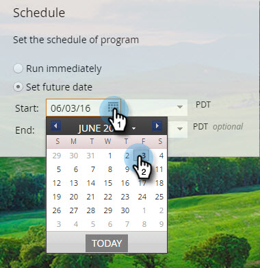

# Programar el mensaje en la aplicación {#schedule-your-in-app-message}

Envíe el mensaje ahora o programe el mensaje para después.

1. Para programar un mensaje en la aplicación, seleccione **Establecer fecha futura** y elija una fecha de inicio en el calendario desplegable.

   

1. Seleccione una hora de inicio en la lista desplegable.

   

1. La fecha y la hora de finalización son opcionales; selecciónelos en los menús desplegables.

   

1. O bien, para ejecutar el programa ahora mismo, seleccione **Ejecutar inmediatamente**. Los campos Fecha de inicio desaparecen.

   

¡Fácil! Por último, pero no menos importante, es el [Aprobación](/help/marketo/product-docs/mobile-marketing/in-app-messages/sending-your-in-app-message/approve-your-in-app-message.md) paso a paso.
