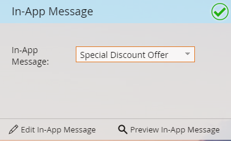

# Previsualizar el mensaje en la aplicación {#select-your-in-app-message}

Aquí es donde selecciona el mensaje que creó para utilizarlo en el programa.

1. Seleccione el mensaje en la aplicación de la lista desplegable.

   

   >[!NOTE]
   >
   >Todos los mensajes están disponibles para su selección, independientemente del lugar en el que se encuentren. Marketo anexa el nombre principal a cada uno, para asegurarse de que cada archivo recibe un nombre único.

1. Una vez seleccionado el mensaje, estará listo. Puede editarlo o previsualizarlo.

   

   >[!TIP]
   >
   >Para seleccionar un mensaje diferente, elimínelo en el campo [!UICONTROL Mensaje en la aplicación]. A continuación, vuelve el vínculo [!UICONTROL Nuevo mensaje en la aplicación]. Haga clic en él y seleccione un mensaje diferente.

Estás en el camino correcto. Tiempo para [programar el envío](/help/marketo/product-docs/mobile-marketing/in-app-messages/sending-your-in-app-message/schedule-your-in-app-message.md).
