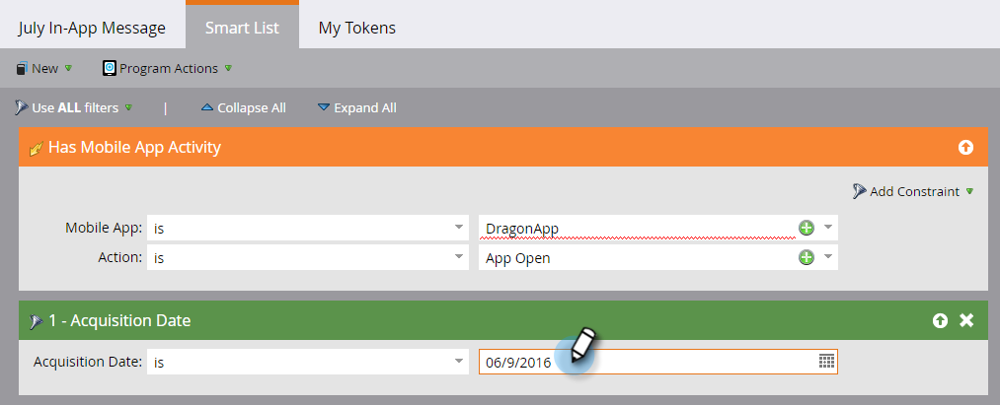

# Configurar la audiencia de mensajes en la aplicación {#set-your-in-app-message-audience}

El primer paso es decidir quién debe recibir el mensaje en la aplicación. Debe configurar la lista inteligente.

1. Haga clic en **Editar lista inteligente**.

   

1. En la lista inteligente, el déclencheur Tiene actividad de aplicación móvil se rellena automáticamente. Haga clic en la lista desplegable y seleccione la aplicación en la que desea colocar el mensaje.

   

   >[!NOTE]
   >
   >Actualmente, los programas de mensajes en la aplicación no admiten varios valores para el campo Aplicación móvil.

1. **Apertura de la aplicación** es la configuración predeterminada de Acción, pero puede seleccionar cualquier evento personalizado que ya haya configurado.

   

   >[!NOTE]
   >
   >El déclencheur predeterminado (Apertura de la aplicación) y los déclencheur personalizados que su desarrollador haya añadido al código se muestran automáticamente en el selector de acciones. Si falta un evento personalizado, consulte con su desarrollador para asegurarse de que ha agregado los eventos personalizados a la aplicación. Tenga en cuenta que el proceso de aprobación y codificación de eventos personalizados puede tardar algún tiempo en completarse. Consulte [este artículo](/help/marketo/product-docs/mobile-marketing/admin/before-you-create-push-notifications-and-in-app-messages.md) para obtener más información.

1. Las restricciones están disponibles para la variable **Tiene actividad de aplicación móvil** déclencheur si los necesitas.

   

1. Puede añadir filtros a la lista inteligente para limitar quién recibe el mensaje en la aplicación. En este ejemplo, utilizando la variable **Fecha de adquisición** , solo se enviará el mensaje en la aplicación a las personas adquiridas el 9 de junio de 2016.

   

1. Vuelva al Panel de control de Campaign de mensajes en la aplicación. Establezca el límite de visualización en la lista desplegable.

   

   >[!NOTE]
   >
   >El límite de visualización predeterminado es **Una vez por sesión**. Si desea que el mensaje deje de mostrarse después de que el destinatario responda, seleccione **Cada vez hasta que se pulse**. Si debe mostrarse cada vez, independientemente de lo que haga el destinatario, elija **Cada vez**.

   

¡Buen trabajo! Tienes tu grupo de audiencia. Te has ganado la barra azul y la marca de verificación verde.

Tiempo para [seleccione el mensaje en la aplicación](/help/marketo/product-docs/mobile-marketing/in-app-messages/sending-your-in-app-message/select-your-in-app-message.md)!
