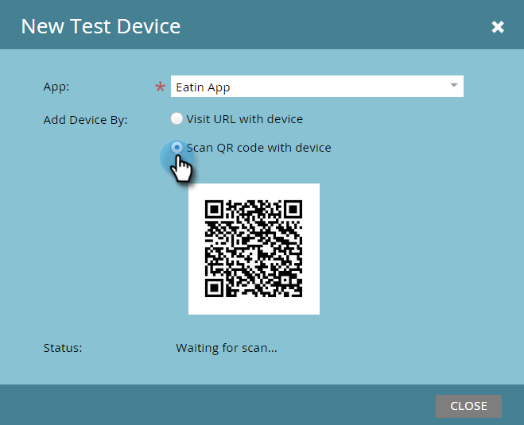

# Añadir un nuevo dispositivo de prueba {#adding-a-new-test-device}

Es fácil agregar un nuevo dispositivo de prueba para insertar notificaciones.

>[!NOTE]
>
>**Se requieren permisos de administración**

1. Haga clic en **Administración** y luego en el vínculo **Aplicaciones móviles**.

   

1. Haga clic en la ficha **Probar dispositivos** y **Nuevo dispositivo de prueba**.

   

1. Seleccione la aplicación.

   

1. Tiene dos formas de conectar el dispositivo a la aplicación.

   Con la primera opción, solo tiene que copiar la URL del campo y enviarla en un mensaje de correo electrónico o de texto a su dispositivo. Desde el dispositivo, toque la dirección URL.

   

   O bien, con la segunda opción, haga clic en el segundo botón y analice el código QR con el dispositivo.

   

1. Se abre la aplicación. Asigne un nombre al dispositivo y toque **Sí**.

   

   ¡Correcto!

   

1. Se agregan las actualizaciones de estado para mostrar el dispositivo. ¡Felicitaciones!

   
