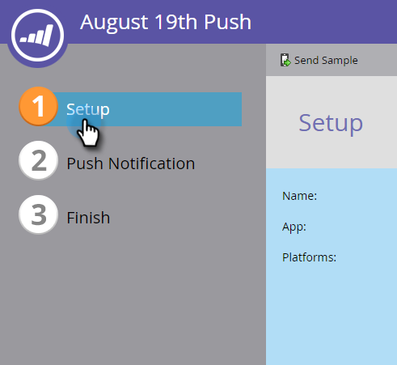

# Configurar la notificación push móvil {#configure-mobile-push-notification}

1. Vaya al área Actividades de marketing.

1. Seleccione el recurso push y haga clic en **Editar borrador**.

   

1. Vaya a **Configuración**.

   

1. Seleccione la aplicación que desee. Las plataformas Android y Apple están activadas de forma predeterminada.

   

   Si el mensaje push solo se aplica a una plataforma (por ejemplo, en el caso de iPhone), puede excluir la otra plataforma desplazando su selector a Deshabilitado.

   

   Haga clic en SIGUIENTE.

   

1. Escriba el texto del mensaje o seleccione el icono del token para agregar tokens. A continuación, seleccione una **Acción de toque**.

   

   >[!NOTE]
   >
   >Si una plataforma está habilitada, aparece en la parte izquierda de la pantalla del teléfono. Se muestra en color cuando se selecciona.

   >[!NOTE]
   >
   >**Definición**
   >
   >
   >Existen tres tipos de acciones de toque***:**
   >
   >
   >**Iniciar aplicación** :  **esto** sustituye la página de inicio de la aplicación cuando se toca la notificación. **Los** clientes utilizan un vínculo profundo para abrir otras áreas de la aplicación o cualquier otra aplicación a la que tenga el vínculo (consulte  [URI de vínculo profundo ](#Deeplink) más abajo para obtener más detalles).
   >
   >
   >**página de aterrizaje** : lo lleva a una página de aterrizaje de marketing especificada.
   >
   >
   >**Dirección URL**  externa: lo lleva a una página de aterrizaje que no es de marketing.

   Para insertar un vínculo profundo para una acción de toque personalizada, haga clic en Personalizado e introduzca el [URI de vínculo profundo](#Deeplink) en el campo.

   

   Para insertar tokens, seleccione un token, introduzca un valor predeterminado y haga clic en Insertar.

   >[!NOTE]
   >
   >Los tokens aparecen donde se coloca el cursor en el cuadro de texto. Puede utilizar más de un token.

   

   >[!NOTE]
   >
   >Los mensajes y las acciones de toque tendrán el mismo aspecto en ambas plataformas.

   Solo para iOS, marque la casilla de verificación para indicar a la aplicación que reproduzca un sonido cuando llegue el mensaje. Android reproduce el sonido automáticamente.

   

   Previsualización la otra plataforma y haga clic en FINALIZAR.

   

1. Haga clic en **APROBAR Y CERRAR**.

   

¡Felicitaciones! Ahora la notificación push está lista para enviarse.

## URI de vínculo profundo {#deep-link-uris}

Cuando los suscriptores hacen clic en un botón de un mensaje push, puede llevarlo a la página de inicio de la aplicación o directamente a una página específica de la aplicación. Un vínculo profundo es una referencia única a una página específica de la aplicación y se parece mucho al vínculo de un sitio web.

Un URI de vínculo profundo consta de tres partes: nombre, ruta e identificador del esquema. En el ejemplo siguiente, &quot;myappname&quot; es el esquema. &quot;products&quot; es la ruta y &quot;púrpura-camisa&quot; es el identificador. Cuando el cliente toca, se lleva específicamente al elemento de la camisa púrpura dentro de las páginas de productos de la aplicación.

Dicho esto, la estructura de vínculos profundos de la aplicación puede ser diferente del ejemplo anterior. El desarrollador tiene muchas opciones para definir URI de vínculo profundo, por lo tanto, pida al desarrollador que le envíe los URI (vínculos) de las páginas que le interesen utilizar. Esto garantizará que los URI que introduzca en los mensajes push apunten a los lugares adecuados. El desarrollador puede [encontrar más información aquí](https://developers.marketo.com/mobile/enabling-deep-links-in-your-app/).

>[!MORELIKETHIS]
>
>* [Enviar una notificación push móvil](send-a-mobile-push-notification.md)

>

