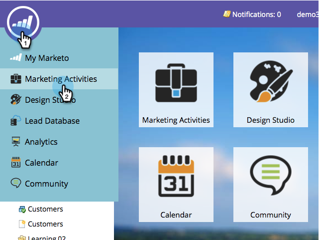

# Editar notificación push para dispositivos móviles {#edit-mobile-push-notification}

1. Vaya al área **[!UICONTROL Actividades de marketing]**.

1. Seleccione su aplicación móvil y haga clic en **[!UICONTROL Editar borrador]**.

   

>[!MORELIKETHIS]
>
>Obtenga más información acerca de [configurar notificaciones push](/help/marketo/product-docs/mobile-marketing/push-notifications/configure-mobile-push-notification.md) aquí.
