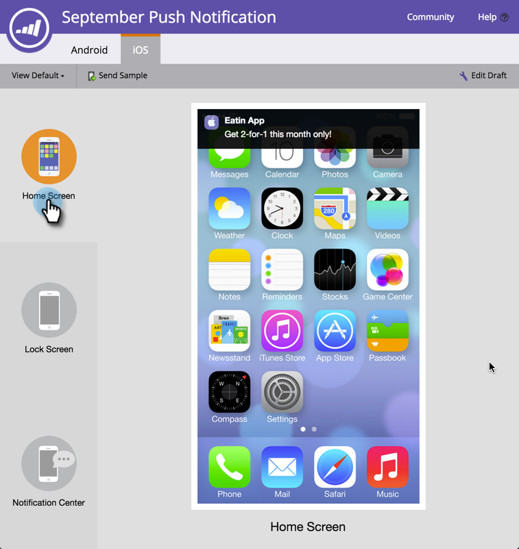

# Previsualización de una notificación push {#preview-a-push-notification}

Es fácil realizar una previsualización del aspecto que tendrá la notificación push para Android o iOS. Hay cuatro maneras de hacerlo.

En el árbol de navegación, haga clic con el botón secundario en el archivo de la notificación que desee previsualización y haga clic en **Previsualización**.

>[!NOTE]
>
>Si la notificación push solo está habilitada para una plataforma, no se muestra la ficha de la otra plataforma.

O bien, en la página de vista de notificaciones push, haga clic en **Acciones de notificaciones push** y luego en **Previsualización**. O bien, haga clic en **Previsualización** en el extremo derecho.

Finalmente, en el editor, puede hacer clic en la ficha **Borrador de Previsualización** en la parte superior derecha mientras trabaja en la notificación.

## Previsualizaciones de Android {#android-previews}

Haga clic en el icono de la izquierda para ver exactamente dónde se mostrará la notificación push al enviarla. Haga clic o utilice las flechas de teclado para alternar entre ellas.

En la pantalla de inicio, la notificación aparece un poco debajo de la parte superior, debajo de los iconos.

En la pantalla Bloquear, aparece en parte abajo, debajo del tiempo.

>[!NOTE]
>
>No hay una vista de centro de notificaciones en Android.

## previsualizaciones de iOS {#ios-previews}

Al igual que con Android, haga clic o utilice las flechas de teclado para alternar entre vistas.

En la pantalla de inicio, la notificación aparece en la parte superior.

En la pantalla Bloquear, se muestra parcialmente hacia abajo.

En la pantalla Centro de notificaciones, está arriba, cerca de la parte superior,

Así que, con la previsualización de notificaciones push, siempre sabe lo que sus clientes van a ver.

>[!MORELIKETHIS]
>
>* [Crear una notificación push](/help/marketo/product-docs/mobile-marketing/push-notifications/create-a-push-notification.md)
>* [Configurar notificaciones push móviles](/help/marketo/product-docs/mobile-marketing/push-notifications/configure-mobile-push-notification.md)

