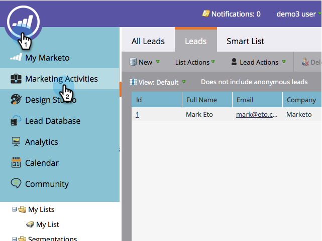
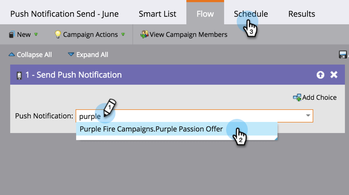

# Enviar una notificación push para dispositivos móviles {#send-a-mobile-push-notification}

Envíe una notificación push a las personas que utilicen su aplicación móvil.

>[!PREREQUISITES]
>
>* [Crear una nueva campaña inteligente](/help/marketo/product-docs/core-marketo-concepts/smart-campaigns/creating-a-smart-campaign/create-a-new-smart-campaign.md)
>* [Crear una notificación push](/help/marketo/product-docs/mobile-marketing/push-notifications/create-a-push-notification.md)

1. Vaya al área **[!UICONTROL Actividades de marketing]**.

   

1. Seleccione su campaña inteligente y haga clic en **[!UICONTROL Smart List]**.

   

1. Defina su lista inteligente y haga clic en **[!UICONTROL Flujo]**.

   

1. Seleccione una notificación push. Haga clic en **[!UICONTROL Programación]**.

   

   >[!NOTE]
   >
   >La notificación push debe aprobarse antes de que aparezca en la lista desplegable.

1. Haga clic en **[!UICONTROL Ejecutar una vez]**.

   

1. Elija una fecha y una hora. Haga clic en **[!UICONTROL Guardar]**.

   

Siéntese y espere a que se emita la notificación push.
