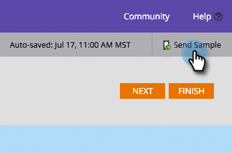

# Enviar una muestra de notificación push {#send-a-push-notification-sample}

Puede enviar un ejemplo para comprobar que la notificación push funciona correctamente.

>[!PREREQUISITES]
>
>Asegúrese de que la aplicación esté instalada en el dispositivo al que envía el ejemplo.

1. Puede enviar un ejemplo de tres formas:

   En el árbol de la izquierda, haga clic con el botón derecho en el recurso de notificación push y haga clic en **[!UICONTROL Enviar muestra]**.

   

   O bien, en el menú de acciones de notificaciones push, haga clic en **[!UICONTROL Enviar muestra]**.

   

   O bien, en el Editor de notificaciones push, haga clic en **[!UICONTROL Enviar muestra]**.

   

1. Si ya ha configurado el dispositivo de prueba que desea utilizar, solo tiene que seleccionarlo en la lista.

   

   O bien, haga clic en **[!UICONTROL Agregar dispositivo]** para [agregar un nuevo dispositivo de prueba](/help/marketo/product-docs/mobile-marketing/push-notifications/adding-a-new-test-device.md) al que enviar la muestra.

   

1. Tiene dos formas de conectar su dispositivo a la aplicación.

   Con la primera opción, haz clic en el botón **[!UICONTROL Visitar URL con el dispositivo]**, copia la URL del campo y envíala en un correo electrónico o mensaje de texto a tu dispositivo. En el dispositivo, pulse la dirección URL. Cuando el estado muestre la conexión, haga clic en **[!UICONTROL Enviar]**.

   

   O, con la segunda opción, haz clic en el botón **[!UICONTROL Escanear código QR con el dispositivo]** y escanea el código QR con tu dispositivo. Cuando el estado muestre la conexión, haga clic en **[!UICONTROL Enviar]**.

   

   >[!TIP]
   >
   >¿Ha agregado correctamente un dispositivo de prueba, pero no lo ve enumerado en el campo **[!UICONTROL Enviar a]**? Marque estas opciones para solucionar problemas:
   >
   >* Las notificaciones push se activan en la aplicación asociada a la notificación push.
   >
   >* La notificación push se configura para la plataforma del dispositivo de prueba. Por ejemplo, si acaba de añadir un iPhone como dispositivo de prueba, asegúrese de que la notificación push esté habilitada para iOS.

¡Tranquilo!
