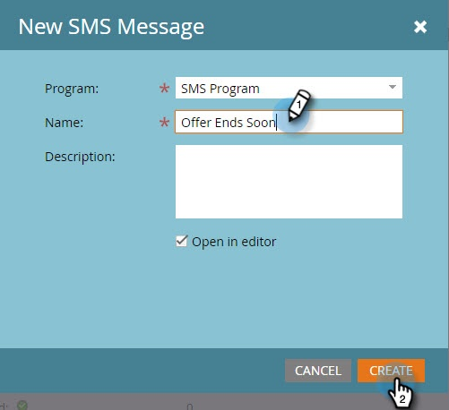

# Crear un mensaje SMS de vídeo {#create-a-vibes-sms-message}

A continuación se explica cómo crear un mensaje SMS de vídeo.

>[!AVAILABILITY]
>
>Esta función está disponible como complemento para su cuenta de Marketo Engage de Adobe. Para que se aprovisione correctamente, debe adquirirse a través del Adobe. Póngase en contacto con el administrador de éxito de los clientes de Adobe para obtener más información.

>[!NOTE]
>
>La mensajería de texto SMS no es compatible con HIPAA.

1. Vaya a **Marketing Activities** y haga clic con el botón derecho en un programa.

   

1. Haga clic en **Nuevo recurso local**.

   

   >[!TIP]
   >
   >También puede hacer clic en la lista desplegable **New**.

1. Haga clic en **Mensaje SMS**.

   

1. Escriba un nombre y una descripción opcional para el nuevo mensaje SMS y haga clic en **Crear**.

   

1. Haga clic en **Editar borrador**.

   

1. En el editor de mensajes, haga clic dentro de la burbuja azul y empiece a introducir texto.

   

   >[!NOTE]
   >
   >Los límites de EE. UU. y Canadá son diferentes, con 160 y 130 caracteres respectivamente. Si supera estos límites de caracteres, su mensaje podría dividirse. Aunque se muestra cuando se supera el límite canadiense, el editor está optimizado para EE. UU. y divide el mensaje en función del límite de EE. UU.

1. Haga clic en **Token** en el menú Insertar para agregar un token al mensaje.

   

   >[!NOTE]
   >
   >Añadir un token puede hacer que el mensaje supere el límite de caracteres. A continuación, el mensaje se divide, lo que resulta en cargos adicionales.

1. Haga clic en **Link** en el menú Insertar para agregar un vínculo al mensaje.

   

1. Seleccione un tipo de vínculo. La página de aterrizaje de Marketo es la predeterminada. Si va con eso, debe seleccionar la página de aterrizaje en la lista desplegable y hacer clic en **Insertar**.

   

   >[!NOTE]
   >
   >Los dos vínculos de seguimiento están seleccionados de forma predeterminada.

1. Si desea utilizar una URL externa en su lugar, haga clic en el botón **External URL** e introduzca la URL en el campo URL. Haga clic en **Insert**.

   

1. El vínculo se muestra en el mensaje.

   

   >[!NOTE]
   >
   >Marketo muestra una vista previa del vínculo del dominio de seguimiento de marca. Si desactiva la casilla de verificación del vínculo mkt_tok, el vínculo cambiará. Desactive también la casilla Track Link y la URL se acortará a su longitud básica (por ejemplo, www.mygooglepage.com).

   

   >[!NOTE]
   >
   >El recuento de caracteres refleja únicamente los caracteres contenidos en el mensaje más bajo.

Si inserta más del límite de EE. UU., el editor divide el mensaje en secciones. Hay un límite total absoluto de 900 caracteres. Después de alcanzar ese límite, el mensaje se trunca automáticamente cuando se envía a su audiencia.
