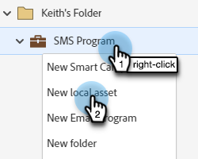

# Creación de un mensaje SMS {#create-an-sms-message}

A continuación se muestra cómo crear un mensaje SMS.

>[!AVAILABILITY]
>
>Esta función está disponible como complemento para su cuenta de Adobe Marketo Engage. Para que se pueda aprovisionar correctamente, debe adquirirse a través del Adobe. Póngase en contacto con el equipo de cuenta de Adobe (su administrador de cuentas) para obtener más información.

>[!PREREQUISITES]
>
>[Añadir vibraciones como servicio de LaunchPoint](/help/marketo/product-docs/mobile-marketing/admin/add-vibes-as-a-launchpoint-service.md){target="_blank"}

1. Ir a **[!UICONTROL Actividades de marketing]**.

   

1. Haga clic con el botón derecho en el programa deseado y seleccione **[!UICONTROL Nuevo recurso local]**.

   

1. Seleccionar **Mensaje SMS**.

   

1. Introduzca un nombre y una descripción opcional para el nuevo mensaje SMS y haga clic en **Crear**.

   

1. En el editor, haga clic dentro de la burbuja azul y empiece a introducir texto.

   

   >[!NOTE]
   >
   >El límite de caracteres de un mensaje SMS es de 160 caracteres con el conjunto de caracteres ASCII estándar. Si supera los 160 caracteres, el mensaje se dividirá en función del recuento total de caracteres.

1. Para añadir un token en el mensaje, escriba un saludo rápido y haga clic en **Token**.

   

   >[!NOTE]
   >
   >Si se añade un token, el mensaje puede superar el límite de caracteres. A continuación, el mensaje se dividiría, lo que crearía un mensaje adicional.

   >[!IMPORTANT]
   >
   >Cumplimiento de SMS: todos los mensajes SMS salientes deben incluir el nombre de la marca o la descripción del programa. Las instrucciones HELP y STOP deben proporcionarse al menos una vez al mes por suscriptor para programas de mensajes recurrentes.

1. Seleccione el **Token**, introduzca un opcional **Valor predeterminado** y haga clic en **Crear**.

   

1. Para añadir un vínculo, seleccione en qué parte del mensaje desea que aparezca y haga clic en **Vínculo**.

   

1. Seleccione un tipo de vínculo. La página de aterrizaje de Marketo es la predeterminada. Si va con él, haga clic en el menú desplegable Landing Page y seleccione la página deseada. Clic **Insertar** cuando termine.

   

   >[!NOTE]
   >
   >Los dos vínculos de seguimiento están seleccionados de forma predeterminada. Desmarcar solo Incluir mkt_tok seguirá permitiendo el seguimiento del vínculo, pero después de redireccionar, la URL de destino no incluirá el parámetro de cadena de consulta mkt_tok. Este parámetro lo utilizan las páginas de aterrizaje de Marketo y Munchkin para garantizar un seguimiento adecuado de las actividades de la persona (como cuando una persona decide excluirse).

1. Si desea utilizar una dirección URL externa en su lugar, seleccione **URL externa**, introduzca/pegue la dirección URL y haga clic en **Insertar**.

   

   >[!NOTE]
   >
   >Si se mantiene seleccionada la opción &quot;Rastrear vínculo&quot;, Marketo modifica automáticamente la dirección URL con fines de seguimiento. Si opta por deshabilitar el seguimiento, la dirección URL se mostrará en el mensaje sin cambios (por ejemplo, `www.adobe.com`).

   >[!CAUTION]
   >
   >Se recomienda lo siguiente _no_ utilice acortadores de URL (por ejemplo, Bitly), ya que los operadores pueden marcar el mensaje como correo no deseado.

1. El vínculo se muestra en el mensaje.

   

   >[!NOTE]
   >
   >Marketo muestra una vista previa de vínculo del dominio de seguimiento marcado. Si desactiva la casilla de verificación del vínculo mkt_tok, se cambia el vínculo.

Si inserta más de 160 caracteres, el editor divide el SMS en secciones. Hay un límite general de 900 caracteres por mensaje. Si supera ese límite, el mensaje se truncará tras la entrega.
