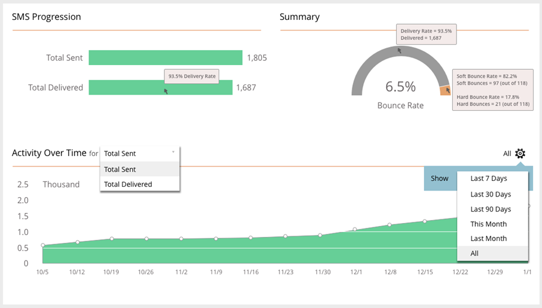

# Informes de SMS {#sms-reporting}

El Tablero de mensajes SMS proporciona análisis de informes útiles sobre sus mensajes.

## Acceso al panel {#access-the-dashboard}

1. Para ver los informes, seleccione el mensaje SMS que desee. Haga clic en **Ver** y seleccione. **Tablero**.

   

1. Aparecerá el tablero.

   

## Información general del panel {#dashboard-overview}

### Progresión de SMS {#sms-progression}

Muestra el total enviado y el total entregado. Las cantidades se encuentran a la derecha y, si pasa el ratón por encima de una barra, se muestra el porcentaje.

### Resumen {#summary}

Muestra la Tasa de salida hacia otro sitio calculada como porcentaje. Pase el ratón sobre la barra de arco para ver la tasa de entrega por cantidad y porcentaje. Pase el ratón sobre la sección naranja de la barra de Tasa de salida hacia otro sitio para ver los porcentajes o las cantidades de Tasa de salida hacia otro sitio suave y dura.

### Actividad con el tiempo {#activity-over-time}

Permite seleccionar Total enviado o Total entregado. Seleccione un intervalo adecuado del selector de intervalo de fechas.

