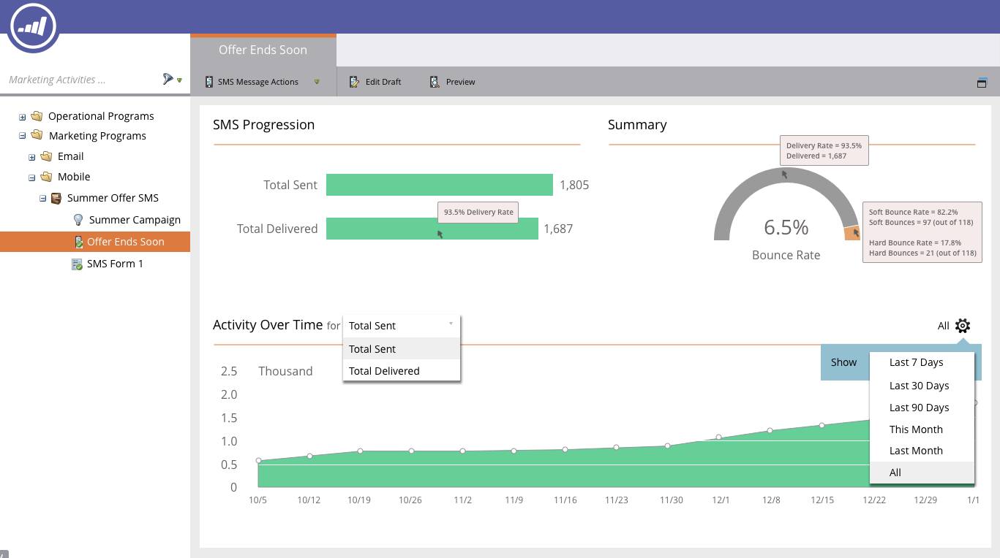

# Tablero de mensajes SMS {#the-sms-message-dashboard}

El panel de mensajes SMS muestra información útil sobre su mensaje SMS.

La variable **Progresión de SMS** gráfico muestra el total enviado y el total entregado. Las cantidades se encuentran a la derecha y si pasa el ratón por encima de una barra, se muestra el porcentaje.

La variable **Resumen** El gráfico muestra la Tasa de salida hacia otro sitio calculada como un porcentaje. Pase el ratón por encima de la barra de archivado para ver la tasa de entrega por cantidad y porcentaje. Pase el ratón sobre la sección Tasa de salida hacia otro sitio naranja de la barra para ver las cantidades y los porcentajes de Tasa de salida hacia otro sitio suave y Tasa de salida hacia otro sitio.

La variable **Actividad a lo largo del tiempo** El gráfico le permite seleccionar Total enviado o Total enviado. Seleccione un intervalo adecuado en el selector de intervalo de fechas.

¡Claro como una campana!
