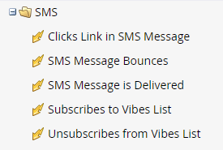

# Uso de las opciones de SMS en Déclencheur y filtros de listas inteligentes {#use-sms-options-in-smart-list-triggers-and-filters}

NUEVO DOC

Después de usted [creación de un mensaje SMS](/help/marketo/product-docs/mobile-marketing/vibes-sms-messages/create-an-sms-message.md){target="_blank"}, querrá usar déclencheur y filtros de listas inteligentes dentro de una campaña inteligente para obtener las ventajas.

>[!PREREQUISITES]
>
>Los déclencheur/filtros SMS solo aparecen si la variable [Se ha habilitado el servicio Vibes](/help/marketo/product-docs/mobile-marketing/admin/add-vibes-as-a-launchpoint-service.md).

## DÉCLENCHEUR de SMS {#sms-triggers}

<table>
  <tr>
    <td></td>
    <td></td>
  </tr>
</table>

A continuación se muestran algunos ejemplos:

El **Devoluciones de mensajes SMS** El déclencheur inicia un flujo, como el envío de un correo electrónico, cuando se devuelve un mensaje SMS.

El **Suscribe a la lista de vídeos** El déclencheur inicia un flujo cuando una persona se suscribe.

El **Vínculo de clics en el mensaje SMS** El déclencheur inicia un flujo cuando una persona hace clic en un vínculo del mensaje SMS.

## Filtros SMS {#sms-filters}

<table>
  <tr>
    <td></td>
    <td></td>
  </tr>
</table>

También puede utilizar los filtros de Vibes en las listas inteligentes. El **Suscrito a la lista de vídeos** El filtro encuentra a cualquiera que tenga *siempre* suscrito a Vibes. Esto incluye tanto a las personas sin suscribir como a las eliminadas, aunque estas se omitan del flujo. Este filtro es el más adecuado para los informes.

Por el contrario, la variable **Miembro de la lista de vibraciones** el filtro encuentra _cualquiera_ está suscrito actualmente a Vibes y es más adecuado para usarlo en campañas inteligentes o listas.

>[!NOTE]
>
>Todos los filtros de SMS incluyen el **Fecha de la actividad** restricción de forma predeterminada.

Después de configurar los déclencheur y filtros de Vibes en la Smart List, puede [definición del flujo](/help/marketo/product-docs/mobile-marketing/vibes-sms-messages/add-a-flow-step-for-sms.md).

>[!MORELIKETHIS]
>
>* [Enviar un mensaje SMS](/help/marketo/product-docs/mobile-marketing/vibes-sms-messages/send-an-sms-message.md)
>* [Definición de listas inteligentes para campañas inteligentes | DÉCLENCHEUR](/help/marketo/product-docs/core-marketo-concepts/smart-campaigns/creating-a-smart-campaign/define-smart-list-for-smart-campaign-trigger.md)
>* [Buscar y agregar filtros a una lista inteligente](/help/marketo/product-docs/core-marketo-concepts/smart-lists-and-static-lists/creating-a-smart-list/find-and-add-filters-to-a-smart-list.md)
