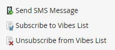

# Uso de las opciones de SMS en una campaña inteligente {#using-sms-options-in-a-smart-campaign}

Después de usted [creación de un mensaje SMS](/help/marketo/product-docs/mobile-marketing/vibes-sms-messages/create-an-sms-message-2.md){target="_blank"}, querrá usar déclencheur y filtros de listas inteligentes dentro de una campaña inteligente para obtener las ventajas.

>[!NOTE]
>
>Si desea enviar un mensaje SMS, tenemos un [artículo específico](/help/marketo/product-docs/mobile-marketing/vibes-sms-messages/send-an-sms-message.md){target="_blank"} por eso.

>[!PREREQUISITES]
>
>Los déclencheur/filtros SMS solo aparecen si la variable [Se ha habilitado el servicio Vibes](/help/marketo/product-docs/mobile-marketing/admin/add-vibes-as-a-launchpoint-service.md){target="_blank"}.

## DÉCLENCHEUR de SMS {#sms-triggers}

<table style="width:600px">
  <tr>
    <td style="width:50%"></td>
    <td style="width:50%"></td>
  </tr>
</table>

A continuación se muestran algunos ejemplos:

El **Devoluciones de mensajes SMS** El déclencheur inicia un flujo, como el envío de un correo electrónico, cuando se devuelve un mensaje SMS.

El **Suscribe a la lista de vídeos** El déclencheur inicia un flujo cuando una persona se suscribe.

El **Vínculo de clics en el mensaje SMS** El déclencheur inicia un flujo cuando una persona hace clic en un vínculo del mensaje SMS.

## Filtros SMS {#sms-filters}

<table style="width:600px">
  <tr>
    <td style="width:50%"></td>
    <td style="width:50%"></td>
  </tr>
</table>

El **Suscrito a la lista de vídeos** El filtro encuentra a cualquiera que tenga *siempre* suscrito a Vibes. Esto incluye tanto a las personas sin suscribir como a las eliminadas, aunque estas se omitan del flujo. Este filtro es el más adecuado para los informes.

Por el contrario, la variable **Miembro de la lista de vibraciones** el filtro encuentra _cualquiera_ está suscrito actualmente a Vibes y es más adecuado para usarlo en campañas inteligentes o listas.

>[!NOTE]
>
>Todos los filtros de SMS incluyen **Fecha de la actividad** restricción de forma predeterminada.

## Pasos de flujo de SMS {#sms-flow-steps}

Hay tres pasos de flujo de SMS para elegir.

<table>
<tbody>
  <tr>
    <td style="width:20%"><b>Enviar mensaje SMS</b></td>
    <td>Esta acción de flujo envía mensajes a las personas de la lista inteligente de Marketo suscritas a una lista de suscripción de Vibes seleccionada por el usuario. No inicia el proceso de suscripción. <a href="/help/marketo/product-docs/mobile-marketing/vibes-sms-messages/send-an-sms-message.md">Más información</a>.</td>
  </tr>

<tr>
    <td style="width:20%"><b>Suscribirse a la lista de Vibes</b></td>
    <td>Esta acción de flujo inicia el proceso de suscripción de SMS mediante una campaña de adquisición de vibraciones seleccionada por el usuario. A continuación, Vibes envía un mensaje de confirmación y el destinatario debe responder con "Y" en un plazo de 24 horas para confirmar la inclusión. Una vez que el usuario se haya suscrito, pasará a ser miembro de su lista de suscripción de Vibes asociada.</td>
  </tr>
  <tr>
    <td style="width:20%"><b>Cancelar suscripción a la lista de Vibes</b></td>
    <td>Esta acción de flujo cancela la suscripción de cada persona a una lista de suscripción de Vibes seleccionada por el usuario. Cuando un usuario envía un mensaje de texto "STOP" a su código, el registro de persona se actualiza para reflejar que ya no es miembro de la lista de suscripción a Vibes.</td>
  </tr>
  </tbody>
</table>

>[!NOTE]
>
>El **Suscribirse a la lista de vibraciones** y **Cancelar suscripción a la lista de vibraciones** Los flujos de tienen diferentes requisitos. Para **Suscribirse**, debe seleccionar la lista Vibes y la campaña de adquisición Vibes. Para **Cancelar suscripción**, solo se requiere la lista Vibes.

>[!MORELIKETHIS]
>
>* [Enviar un mensaje SMS](/help/marketo/product-docs/mobile-marketing/vibes-sms-messages/send-an-sms-message.md){target="_blank"}
>* [Definición de listas inteligentes para campañas inteligentes | Déclencheur](/help/marketo/product-docs/core-marketo-concepts/smart-campaigns/creating-a-smart-campaign/define-smart-list-for-smart-campaign-trigger.md){target="_blank"}
>* [Definición de listas inteligentes para campañas inteligentes | Lote](/help/marketo/product-docs/core-marketo-concepts/smart-campaigns/creating-a-smart-campaign/define-smart-list-for-smart-campaign-batch.md){target="_blank"}
