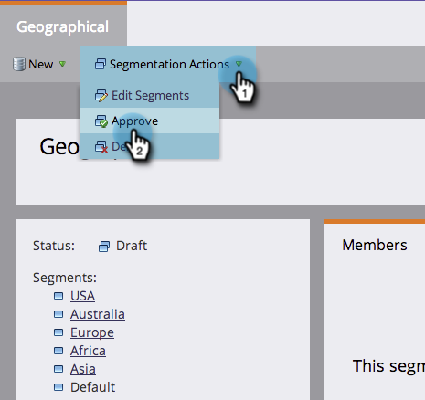

# Definir reglas de segmentos {#define-segment-rules}

La definición de reglas de segmentos le permite categorizar a las personas en diferentes grupos mutuamente excluyentes.

>[!PREREQUISITES]
>
>[Crear una segmentación](/help/marketo/product-docs/personalization/segmentation-and-snippets/segmentation/create-a-segmentation.md)

1. Vaya a la **Base de datos.**

   

1. Select **Segmentación** en el árbol, haga clic en un **Segmento**.

   

1. Haga clic en **Lista inteligente** y añadir filtros.

   

   >[!CAUTION]
   >
   >Los segmentos actualmente no son compatibles _En el pasado_ y _En el intervalo de tiempo_  operadores en filtros. Esto se debe a que las segmentaciones solo buscan actualizaciones cuando se registra un valor de datos de cambio. Estos valores son _not_ registrado para elementos que cambian automáticamente, como campos de fórmula y fechas. Además, no se admiten los operadores de fecha con intervalos de fechas relativos, ya que se calculan en el momento de la aprobación de la segmentación, no en el momento de una actividad Cambiar valor de datos .

   >[!NOTE]
   >
   >Los filtros &quot;Tipo de SFDC&quot; y &quot;Tipo de Microsoft&quot; no son compatibles actualmente con las listas inteligentes de segmentación.

1. Rellene los valores adecuados para los filtros.

   

   >[!CAUTION]
   >
   >El comportamiento de registro de actividades de los campos Cuenta puede afectar a la calificación. Por lo tanto, no se recomienda el uso de campos Cuenta al definir reglas de segmento.

1. Haga clic en el **Personas (borrador)** para ver las personas que pueden cumplir los requisitos para ser miembros de este segmento.

   

1. Vaya a **Acciones de segmentación**. Haga clic en **Aprobar**.

   

   >[!CAUTION]
   >
   >El número total de segmentos que puede crear en una segmentación depende del número y el tipo de filtros utilizados y también de la complejidad de la lógica de los segmentos. Aunque puede crear hasta 100 segmentos utilizando campos estándar, el uso de otros tipos de filtros puede aumentar la complejidad, y es posible que la segmentación no apruebe. Algunos ejemplos son: campos personalizados, miembro de lista, campos de propietario del posible cliente y etapas de ingresos.
   >
   >Si recibe un mensaje de error durante la aprobación y necesita ayuda para reducir la complejidad de la segmentación, póngase en contacto con [Asistencia de Marketo](https://nation.marketo.com/t5/Support/ct-p/Support).

1. Consulte el tablero para ver información general rápida de los segmentos en un gráfico circular, así como las reglas aplicadas.

   

¡Buen trabajo! Estos segmentos serán útiles en muchos lugares de Marketo.

>[!NOTE]
>
>Una persona puede cumplir los requisitos para distintos segmentos, pero finalmente pertenece a una que depende de la variable [orden de prioridad de los segmentos](/help/marketo/product-docs/personalization/segmentation-and-snippets/segmentation/segmentation-order-priority.md).

>[!NOTE]
>
>La pantalla Personas (Borrador) muestra todas las personas que cumplen los requisitos para ser miembros y no siempre es la lista final de personas. Apruebe el segmento para ver la lista final.

>[!MORELIKETHIS]
>
>[Aprobar una segmentación](/help/marketo/product-docs/personalization/segmentation-and-snippets/segmentation/approve-a-segmentation.md)
